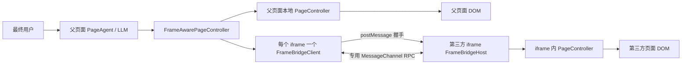
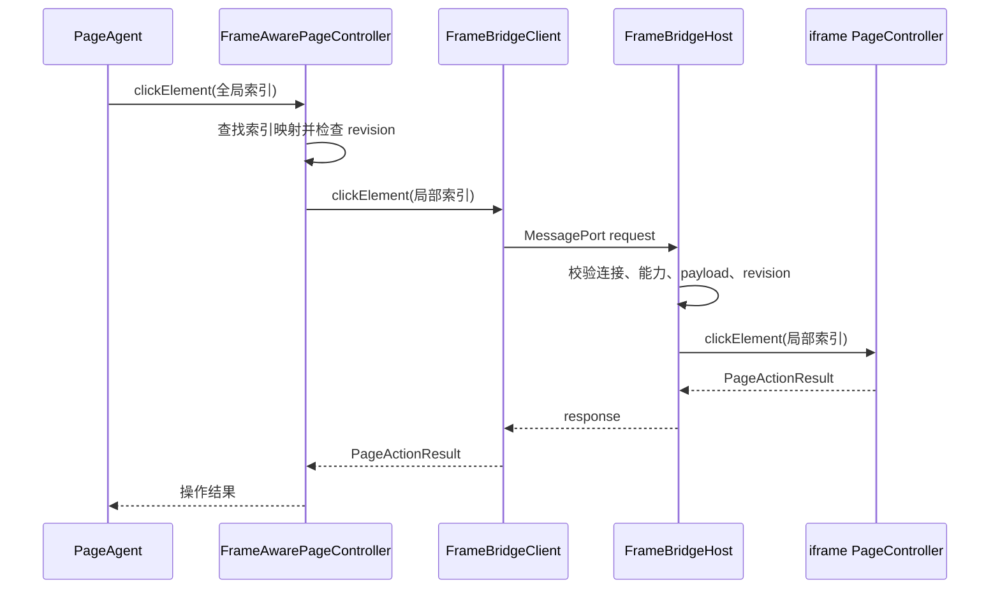

# iframe bridge 工作机制与接入复杂度分析

## 1. 结论摘要

`iframe-bridge` 是一套面向跨域 iframe 的**主动协作协议**。它不绕过浏览器同源策略，而是让父页面和 iframe 分别在自己的同源环境中运行 `PageController`，再通过经过双向来源校验的 `postMessage` 和专用 `MessageChannel` 交换页面状态及受限操作请求。

其核心设计原则是：

-   父页面保留 Page Agent、LLM、密钥和任务编排权；
-   iframe 只开放明确授权的页面观察和交互能力；
-   父页面将本地页面和多个 iframe 聚合成统一的可观察、可操作页面模型；
-   单个 iframe 连接失败时降级处理，不阻断父页面和其他 iframe；
-   通过 origin 白名单、能力白名单、请求校验和状态版本控制降低安全与一致性风险。

从接入便利性看，bridge 的代码接入量不大，但它要求 iframe 提供方主动配合。若父页面与 iframe 由同一团队控制，整体属于中等复杂度；若 iframe 来自独立第三方，成本主要来自跨团队协调、安全审批、部署策略和版本治理，而不是通信代码本身。

## 2. 适用场景与边界

### 2.1 适用场景

iframe bridge 适合双方存在合作关系、且 iframe 提供方愿意明确授权的场景，例如：

-   企业内部不同域名的业务系统；
-   SaaS 主应用嵌入自有子产品；
-   跨域部署的微前端模块；
-   可控的合作伙伴业务组件；
-   需要由父页面统一提供 AI 自动化能力的嵌入式应用。

### 2.2 不适用场景

以下情况无法直接使用或不建议使用：

-   iframe 提供方不能或不愿修改页面；
-   iframe 是广告、支付、认证等完全不可控的第三方页面；
-   子页面禁止被目标父域嵌入；
-   iframe 使用 `data:`、`file:` 或缺少 `allow-same-origin` 的 sandbox，导致 origin 为 `null`；
-   需要自动操作孙级或更深层的嵌套 iframe；
-   需要跨 iframe 执行任意 JavaScript；
-   父子双方无法协调 SDK 或 bridge 协议版本。

因此，iframe bridge 应被定义为 **cooperative bridge（协作桥接）**，而不是“支持任意第三方 iframe”的通用跨域方案。

## 3. 架构概要



### 3.1 组件职责

| 组件                       | 所在位置           | 主要职责                                                  |
| -------------------------- | ------------------ | --------------------------------------------------------- |
| `PageAgent`                | 父页面             | 接收用户任务、调用 LLM、规划操作                          |
| `FrameAwarePageController` | 父页面             | 聚合本地页面与跨域 iframe 状态，维护全局索引并路由动作    |
| `FrameBridgeClient`        | 父页面             | 管理单个 iframe 的握手、RPC、超时、取消和生命周期         |
| `FrameBridgeHost`          | 子 iframe          | 验证父页面身份、限制能力、校验请求并调用子页面 controller |
| `PageController`           | 父、子页面各自拥有 | 在所属同源 DOM 中提取状态并执行页面操作                   |
| `protocol.ts`              | 双方共享           | 定义协议版本、消息类型、能力列表和错误码                  |

### 3.2 父子双方的职责边界

父页面负责：

-   创建 Page Agent 和 LLM 客户端；
-   保管模型密钥和网关配置；
-   选择允许协作的 iframe；
-   配置允许连接的子页面 origin；
-   聚合本地和远程页面状态；
-   将 Agent 动作路由到正确的页面或 iframe。

iframe 提供方负责：

-   创建 iframe 内部的 `PageController`；
-   启动 `FrameBridgeHost`；
-   配置允许连接的父页面 origin；
-   决定开放哪些观察和操作能力；
-   控制哪些 DOM 内容可以进入观察状态；
-   在页面销毁或替换时释放 host 和 controller。

子页面不创建 Page Agent、不调用 LLM，也不需要模型 API key。

## 4. 工作机制与工作原理

### 4.1 iframe 发现

`FrameAwarePageController` 使用显式的 `frameSelector` 搜索父文档中的 iframe，例如：

```ts
frameSelector: 'iframe[data-page-agent-bridge]'
```

只有同时满足以下条件的 iframe 才会进入 bridge 流程：

1. 匹配指定 selector；
2. 是父页面的直接子 iframe；
3. 当前页面与父页面跨域；
4. iframe `src` 的 origin 位于 `allowedChildOrigins` 中。

同源 iframe 继续交给父页面本地 `PageController` 处理，避免重复发现和重复索引。

### 4.2 双向鉴权握手

连接过程分为三个阶段：

1. 父页面向 iframe 发送 `discover` 消息；
2. iframe 校验父页面后返回 `available`，其中包含 `frameInstanceId` 和能力列表；
3. 父页面创建 `MessageChannel`，发送 `connect` 并向 iframe 转移一个 port，iframe 再通过该 port 返回 `connected`。

握手时会校验：

-   `protocol` 和 `version`；
-   `event.origin` 是否位于精确白名单中；
-   `event.source` 是否是预期的父窗口或 iframe `contentWindow`；
-   `sessionId`；
-   `frameInstanceId`；
-   iframe 当前 `src` 对应的 origin。

配置明确拒绝：

-   `*` 通配 origin；
-   `null` 或其他不透明 origin；
-   包含路径、查询参数或 fragment 的值；
-   非 HTTP(S) origin。

握手完成后，普通请求不再通过全局 `window.message` 通道，而是通过该 iframe 独占的 `MessagePort` 传输。这样可以减少消息冲突，并隔离不同 iframe 的连接。

### 4.3 页面状态提取与聚合

子页面通过自己的 `PageController.getBrowserState()` 提取：

-   URL 和标题；
-   简化后的 DOM 内容；
-   可操作元素索引；
-   页面和元素的滚动信息；
-   `treeRevision` 状态版本。

父页面不能直接复用子页面的局部索引，因为父页面和多个 iframe 可能存在相同编号。`FrameAwarePageController` 会执行以下处理：

1. 保留父页面本地元素索引；
2. 为每个 iframe 的局部索引分配全局唯一索引；
3. 保存“全局索引 → iframe client + 子页面局部索引”的映射；
4. 为 iframe 文档本身分配一个仅用于滚动的索引；
5. 将所有状态聚合为包含 `<cross-origin-frame>` 的统一观察结果。

因此，从 Page Agent 和 LLM 的视角看，父页面和 iframe 共同组成了一棵统一的页面树。

### 4.4 动作路由

当 Agent 操作某个全局索引时，`FrameAwarePageController` 首先查询索引映射：

-   本地元素：直接调用父页面 `PageController`；
-   iframe 内元素：还原为子页面局部索引，再通过对应 `FrameBridgeClient` 发送请求；
-   iframe 文档索引：只允许执行文档级滚动，不允许点击、输入或选择。

以远程点击为例：



### 4.5 能力控制

Version 1 支持以下远程能力：

| capability           | 对应能力             |
| -------------------- | -------------------- |
| `observe`            | 获取 iframe 页面状态 |
| `click`              | 点击元素             |
| `input`              | 输入文本             |
| `select`             | 选择下拉选项         |
| `scroll`             | 垂直滚动页面或元素   |
| `scrollHorizontally` | 水平滚动页面或元素   |
| `cleanup`            | 清理 controller 高亮 |

iframe 提供方可以只开放业务需要的能力。例如只读组件可以只配置 `observe`。

`executeJavascript` 被明确排除：它既不属于 bridge method，也不在 host 的请求分发器中，不能通过 bridge 转发任意脚本。

### 4.6 串行执行与状态一致性

Host 会串行执行 controller 请求，避免多个 DOM 操作并发修改页面。

每次观察都会返回 `treeRevision`。执行索引动作之前，父子双方会检查动作使用的 revision 是否仍然有效。如果页面状态已经更新，则返回 `STALE_TREE`，要求重新观察后再操作。

这一机制可以降低 Agent 使用旧索引操作错误元素的风险。

### 4.7 超时、取消与结果不确定性

bridge 区分不同执行阶段：

-   请求尚未发出或尚未开始：可以明确返回 `ABORTED` 或 `TIMEOUT`；
-   修改型请求已经发出或开始执行：超时或取消后可能返回 `OUTCOME_UNKNOWN`。

`OUTCOME_UNKNOWN` 表示操作可能已经成功，但父页面没有收到最终响应。对于提交订单、支付或其他非幂等动作，调用方不能直接重试，而应先重新观察页面并确认实际结果。

### 4.8 导航、移除与降级

-   iframe 导航或重新加载会使旧端口、请求和索引失效；
-   下一次观察时，父页面会尝试重新握手；
-   动态加入并匹配 selector 的 iframe 会被发现；
-   被移除或不再匹配 selector 的 iframe 会被释放；
-   导航为同源页面后，该 iframe 会退出 bridge，改由本地 controller 处理；
-   单个 iframe 未安装 host、握手失败或请求超时时，会被标记为 unavailable；
-   本地页面和其他可用 iframe 可以继续工作。

## 5. 接入复杂度与便利性评估

### 5.1 普通同源网页接入

如果页面没有跨域 iframe，接入方通常只需在顶层页面创建一个普通 `PageController`：

```ts
import { PageAgent } from 'page-agent'
import { PageController } from '@page-agent/page-controller'

const agent = new PageAgent({
    pageController: new PageController(),
    model: 'your-model',
    apiKey: 'YOUR_API_KEY',
})
```

这种方式具有以下特点：

-   只需要父页面团队接入；
-   不需要第三方页面修改代码；
-   不需要跨窗口握手和通信；
-   不需要配置父子 origin 白名单；
-   一个 controller 可以直接读取并操作同源 DOM；
-   元素索引属于一棵本地 DOM 树，无需全局重映射；
-   不需要处理 iframe 连接、导航重连和 bridge 协议兼容。

因此，普通接入属于单方、单应用改造，代码和部署复杂度较低。

### 5.2 iframe bridge 接入

存在跨域 iframe 时，父页面无法直接读取 iframe DOM。要让 Page Agent 观察和操作其中的内容，父页面和 iframe 提供方必须分别完成接入。

父页面示例：

```ts
import { PageAgent } from 'page-agent'
import { FrameAwarePageController, PageController } from 'page-agent/iframe-bridge'

const pageController = new FrameAwarePageController({
    localController: new PageController(),
    frameSelector: 'iframe[data-page-agent-bridge]',
    allowedChildOrigins: ['https://widgets.example.com'],
    handshakeTimeoutMs: 1000,
    requestTimeoutMs: 5000,
})

const agent = new PageAgent({
    pageController,
    model: 'your-model',
    apiKey: 'YOUR_API_KEY',
})
```

iframe 提供方示例：

```ts
import { FrameBridgeHost, PageController } from '@page-agent/page-controller/iframe-bridge'

const bridgeHost = new FrameBridgeHost({
    controller: new PageController(),
    allowedParentOrigins: ['https://app.example.com'],
    capabilities: ['observe', 'click', 'input', 'select'],
})

bridgeHost.start()
```

### 5.3 两种接入方式对比

| 接入环节       | 普通同源网页                 | iframe bridge                                              | bridge 增加的工作                |
| -------------- | ---------------------------- | ---------------------------------------------------------- | -------------------------------- |
| 参与方         | 仅父页面团队                 | 父页面团队和 iframe 提供方                                 | 跨团队协调                       |
| SDK 安装       | 父页面安装                   | 父页面和子页面分别安装                                     | 子页面新增依赖                   |
| Controller     | 一个本地 controller          | 父页面和子页面各有 controller                              | 子页面初始化和维护 controller    |
| 父页面封装     | 直接使用 `PageController`    | 使用 `FrameAwarePageController`                            | selector、origin、超时配置       |
| 子页面改造     | 不需要                       | 创建并启动 `FrameBridgeHost`                               | 修改并重新发布 iframe            |
| 页面选择       | 默认处理当前页面             | 显式配置 `frameSelector`                                   | 标记允许接入的 iframe            |
| 来源授权       | 通常不需要                   | 双方配置精确 origin 白名单                                 | 管理不同环境的域名和端口         |
| 能力授权       | 本地 controller 能力         | iframe 配置 capability                                     | 设计最小权限集合                 |
| CSP/嵌入策略   | 主要关注应用自身 CSP         | 同时检查 `frame-src`、`frame-ancestors` 和 X-Frame-Options | 父子部署侧配合                   |
| iframe sandbox | 通常不涉及                   | 确认 `allow-scripts` 和 `allow-same-origin`                | 平衡功能与安全限制               |
| DOM 访问       | 直接访问                     | 子页面提取后通过 MessageChannel 返回                       | 通信和数据序列化                 |
| 元素索引       | 单一本地索引空间             | 聚合层重映射多个 iframe 索引                               | 框架自动完成，业务需理解索引时效 |
| 页面导航       | 本地刷新状态                 | iframe 导航会断开并重新握手                                | 验证失效和重连流程               |
| 异常处理       | 主要是本地操作异常           | 增加握手超时、RPC 超时、连接关闭和结果未知                 | UI 和业务处理 bridge 错误        |
| 数据安全       | 数据主要在当前页面逻辑内使用 | iframe 观察数据发送给父页面并可能进入 LLM                  | 数据分类和脱敏评估               |
| 版本兼容       | 主要关注父页面 SDK           | 父子 package 和 bridge 协议需要兼容                        | 双方协调升级                     |
| 测试环境       | 一个 origin 通常足够         | 至少两个不同 origin                                        | 跨域 E2E 和部署验证              |

### 5.4 bridge 额外增加的接入步骤

#### 父页面接入方

1. 将普通 `PageController` 包装为 `FrameAwarePageController`；
2. 为允许接入的 iframe 添加明确标识；
3. 配置 `frameSelector`；
4. 配置 `allowedChildOrigins`；
5. 根据实际加载情况配置握手和请求超时；
6. 在应用销毁时调用 `dispose()`；
7. 监听 `bridgeerror`、`invalidate` 等事件；
8. 为不可用、重连、旧索引和结果未知设计处理逻辑；
9. 确认父页面 CSP 允许加载子页面；
10. 验证生产、预发和测试环境中的协议、域名及端口。

#### iframe 提供方

1. 安装 `@page-agent/page-controller`；
2. 创建 iframe 自己的 `PageController`；
3. 创建并启动 `FrameBridgeHost`；
4. 配置 `allowedParentOrigins`；
5. 按最小权限原则配置 capabilities；
6. 在页面卸载或 SPA 文档替换时调用 `dispose()`；
7. 确认 `frame-ancestors` 和 X-Frame-Options 允许父页面嵌入；
8. 如果设置了 sandbox，确保 bridge 脚本和精确 origin 能够正常工作；
9. 评估哪些页面文本和属性可以发送给父页面；
10. 配合父页面完成跨域联调和版本升级测试。

#### 双方共同工作

1. 确认各环境完整、准确的 origin 清单；
2. 协调 SDK 和协议版本；
3. 验证 iframe 初始加载、延迟加载和动态插入；
4. 验证 iframe 导航、刷新和 SPA 路由切换；
5. 验证 host 缺失、CSP 拒绝和请求超时等降级路径；
6. 确认高风险动作在 `OUTCOME_UNKNOWN` 时不会被盲目重复执行；
7. 建立不记录敏感页面原文的监控和诊断机制。

### 5.5 不同角色的复杂度

| 角色或场景                       | 复杂度 | 主要成本                                       |
| -------------------------------- | ------ | ---------------------------------------------- |
| 普通同源网页接入方               | 低     | 初始化 Page Agent 和本地 controller            |
| bridge 父页面接入方              | 中     | controller 包装、iframe 选择、白名单和异常处理 |
| 具有现代构建系统的 iframe 提供方 | 低到中 | 初始化 host、能力配置和父域白名单              |
| 外部第三方 iframe 提供方         | 中到高 | 代码改造、安全审批、重新发版和跨团队联调       |
| 部署与安全团队                   | 中     | CSP、X-Frame-Options、sandbox 和数据暴露评估   |
| 最终用户                         | 低     | 正常情况下无须感知 iframe 边界                 |

### 5.6 接入便利性的决定因素

框架已经自动处理：

-   握手和 `MessageChannel` 创建；
-   多 iframe 并行观察；
-   本地与远程状态聚合；
-   全局索引重映射；
-   动作路由；
-   revision 校验；
-   iframe 导航失效和重新连接；
-   单 iframe 失败降级。

因此，父子双方各自的初始化代码并不复杂。真正决定接入便利性的因素是 iframe 的可控程度：

| 场景                         | 接入便利性 | 判断                             |
| ---------------------------- | ---------- | -------------------------------- |
| 父页面和 iframe 属于同一团队 | 较高       | 主要是工程改造                   |
| 同一公司、不同团队维护       | 中等       | 需要域名、权限和发布协调         |
| 可配合的合作伙伴组件         | 中等偏低   | 需要协议、安全和版本协商         |
| 完全不可控的第三方 iframe    | 无法接入   | 第三方必须主动部署 host          |
| 支付、认证等高敏感 iframe    | 较低       | 即使技术可行，也需要严格安全审批 |

与普通同源网页相比，iframe bridge 的主要额外成本不是 RPC 代码，而是：

-   获得 iframe 提供方的主动配合；
-   协调父子双方部署配置；
-   明确能力授权和数据边界；
-   增加跨域生命周期与异常场景测试；
-   建立双方版本升级和问题诊断机制。

## 6. 最终用户体验

### 6.1 正常体验

正常情况下，iframe 边界对最终用户基本透明。例如用户发出“填写订单信息”的指令后，Agent 可以统一理解并操作父页面和 iframe 内的表单，而不要求用户手动切换上下文。

典型体验包括：

-   用户使用自然语言描述完整任务；
-   Agent 同时观察本地页面和已授权 iframe；
-   动作执行前自动将 iframe 滚动到可见位置；
-   本地页面和 iframe 表现为连续的自动化流程；
-   单个 iframe 暂时不可用时，其他页面区域仍可继续工作。

### 6.2 用户可能感知的问题

用户可能遇到：

-   iframe 首次连接带来的短暂等待；
-   iframe 尚未加载完成，暂时无法操作；
-   页面变化后旧索引失效，需要重新观察；
-   iframe 导航后短暂重连；
-   单个第三方组件不可用；
-   操作超时但实际结果不确定。

底层错误码适合诊断，但不应直接展示给普通用户。建议映射为可理解、可行动的提示：

| 底层状态            | 建议用户提示                                 |
| ------------------- | -------------------------------------------- |
| `TIMEOUT`           | 第三方组件尚未响应，请稍后重试               |
| `CONNECTION_CLOSED` | 组件已刷新或跳转，正在重新连接               |
| `STALE_TREE`        | 页面内容已变化，正在重新确认                 |
| `CAPABILITY_DENIED` | 此组件未授权执行该操作                       |
| `OUTCOME_UNKNOWN`   | 操作可能已经完成，请先检查结果，不要重复提交 |

## 7. 安全模型与数据边界

### 7.1 已提供的安全机制

-   父子双方精确 origin 白名单；
-   同时验证 `event.source` 和 `event.origin`；
-   握手后使用专用 `MessageChannel`；
-   session、frame instance 和 request ID 校验；
-   协议版本校验；
-   capability 最小权限控制；
-   method 和 payload 严格校验；
-   禁止远程执行任意 JavaScript；
-   iframe 导航后旧连接和旧索引失效；
-   revision 校验和请求串行执行。

### 7.2 数据边界

origin 和能力校验解决的是“谁能连接、可以执行什么操作”，并不构成内容脱敏边界。

子页面 controller 放入观察状态的文本、URL、标题和属性会发送给父页面，并可能成为 LLM 上下文。因此：

-   iframe 提供方必须信任允许连接的父页面；
-   密码、token、支付信息和隐私数据不能只依赖 bridge 过滤；
-   应通过页面结构或 controller 配置排除敏感节点和属性；
-   不应在普通日志中记录完整观察内容；
-   LLM API key 只能保留在父页面受控配置或后端代理中，不能放入 iframe、URL 或 bridge 消息。

### 7.3 CORS 与浏览器嵌入策略

bridge 使用 `postMessage`，不依赖 CORS。CORS 只管理 `fetch` 和 XHR，不能授权父页面读取跨域 iframe DOM。

实际需要协调的是：

-   父页面 CSP 的 `frame-src` 或 `child-src`；
-   子页面 CSP 的 `frame-ancestors`；
-   子页面的 `X-Frame-Options`；
-   iframe 的 `sandbox` 配置。

如果使用 sandbox，通常至少需要：

```html
<iframe
    data-page-agent-bridge
    src="https://widgets.example.com/embedded"
    sandbox="allow-scripts allow-same-origin"
></iframe>
```

缺少 `allow-same-origin` 会产生 `null` origin，精确 origin 握手将按设计拒绝连接。

## 8. 设计评价

| 维度         | 评价           | 说明                                                     |
| ------------ | -------------- | -------------------------------------------------------- |
| 架构解耦     | 较好           | Agent 和 LLM 留在父页面，子页面只依赖 controller         |
| 安全默认值   | 较好           | 拒绝通配 origin，限制方法和 payload，禁止远程 JavaScript |
| Agent 透明性 | 较好           | 使用统一索引空间，Agent 无须理解具体 iframe 路由         |
| 故障隔离     | 较好           | 单 iframe 失败不阻断本地页面和其他 iframe                |
| 状态一致性   | 较好           | 使用 `treeRevision`、frame instance 和串行请求           |
| 代码接入门槛 | 较低           | 父子双方初始化代码较集中                                 |
| 综合交付成本 | 中等           | 需要第三方配合、部署调整和跨域测试                       |
| 内容隐私     | 依赖业务治理   | bridge 本身不是内容脱敏层                                |
| 嵌套 iframe  | 有限           | 只支持直接子 iframe，不递归发现                          |
| 协议演进     | 需要关注       | 当前协议为 Version 1，需要父子版本兼容                   |
| 用户反馈     | 需要产品层补充 | 底层错误完整，但应转换为用户级提示和恢复策略             |

## 9. 最终评估

iframe bridge 的技术方案建立在清晰的信任和职责边界上：父页面负责智能决策和统一编排，iframe 负责在自己的安全边界内提供有限的页面能力。它通过标准浏览器通信机制解决跨域协作，而没有削弱浏览器同源隔离。

在 iframe 可控、双方能够协同发布的场景中，该方案以适中的接入成本显著改善了 Page Agent 对跨域页面的可见性和操作连续性，整体设计合理且具有较好的故障隔离能力。

在外部第三方场景中，便利性的主要瓶颈是合作和治理成本。评估能否接入时，应优先确认以下三个问题：

1. 第三方是否愿意并能够安装和维护 `FrameBridgeHost`；
2. 双方是否可以协调 origin、CSP、能力权限和版本发布；
3. iframe 中可观察的数据是否允许发送给父页面及其 LLM。

只有这三个条件同时成立，iframe bridge 才是可落地且可长期维护的接入方式。

## 10. 相关实现与文档

-   [`FrameAwarePageController.ts`](../packages/page-controller/src/iframe-bridge/FrameAwarePageController.ts)
-   [`FrameBridgeClient.ts`](../packages/page-controller/src/iframe-bridge/FrameBridgeClient.ts)
-   [`FrameBridgeHost.ts`](../packages/page-controller/src/iframe-bridge/FrameBridgeHost.ts)
-   [`protocol.ts`](../packages/page-controller/src/iframe-bridge/protocol.ts)
-   [跨域 iframe bridge 集成指南](./cross-origin-iframe-bridge.zh-CN.md)
-   [iframe bridge E2E 测试](../packages/e2e/tests/iframe-bridge.spec.ts)
