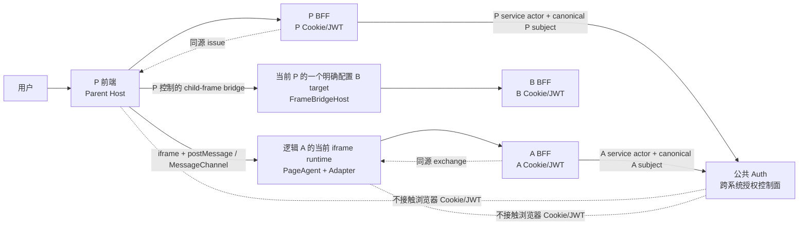
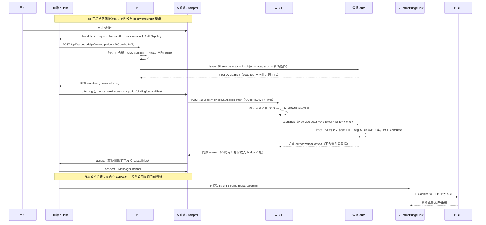

# P / A / B 与公共 Auth 权威架构

本文是 PageAgent 跨域助手部署中授权架构的权威说明。它冻结 P（Parent）、A（Assistant）、
B（Business）和公共 Auth 的职责、请求流、数据模型与安全不变量；生产接入的操作清单、响应头、
灰度和回滚步骤见[iframe PageAgent 生产部署手册：P / A / B 职责](./parent-bridge-production-deployment.zh-CN.md)。
尚未冻结的设计、生产缺口、责任人和验收证据统一维护在
[P / A / B / Auth 架构待决事项台账](./parent-bridge-architecture-open-issues.zh-CN.md)，不以正文中的
建议方案替代正式决策记录。
如果运行手册中的旧描述与本文冲突，以本文为准，并应在发布前修正运行手册。

桥接 wire protocol 和 DOM 边界见[父页面控制器桥接](./parent-bridge.zh-CN.md)。当前协议增加了
不含身份、policy 或业务数据的 `handshake-request`/`deactivate` 控制消息；业务请求仍只在
`MessageChannel` 中传输，业务授权逻辑不搬进浏览器。

## 1. 冻结的拓扑与职责边界

每个 `environment` 恰好只有一个逻辑 A 系统：一个 `AssistantApp` 身份、一套 A BFF 和一套 A
service identity 归属。A BFF 可以有后端副本，但副本不构成新的 A；生产和测试环境彼此独立。
这个逻辑 A 可以被多个 P 以各自的 iframe 实例嵌入；每个 P 可以服务多个 tenant，也可以为每个
`Integration` 注册多个 B。运行时只有一条可接受的操作路径：

```text
A（当前助手 iframe） → 当前 P（唯一父页代理） → 明确配置的 B（协作业务 iframe）
```

A 不直连 B，也不通过同级 iframe、URL、CORS 或任何浏览器 API 绕过 P。P 是父页 DOM 和 B 代理的
唯一汇合点；B 仍是自身业务后端的最终拒绝方。

上述是逻辑系统的基数，不是浏览器进程或 iframe 数量。每个 P 页面/标签页都嵌入自己的 A 浏览器
iframe runtime instance，并独立拥有 `frameInstanceId`、bridge session、`MessageChannel`、activation、
任务状态和每个 Host 的 auth client；A iframe reload 会创建新的 runtime instance。一个逻辑 A 不等于
一个 iframe，也不等于一个进程。

下图仅展示一个运行时切片：一个 P 页面/标签页、一个 tenant context、一个 A iframe runtime instance、
一个 bridge session 和一个当前 B target；它不表示系统只能有一个 P、tenant 或 B。



四方的边界如下：

| 组件 | 必须负责                                                                                                      | 不负责、不能替代                                                                      |
| ---- | ------------------------------------------------------------------------------------------------------------- | ------------------------------------------------------------------------------------- |
| P    | 当前页面用户/租户权限、root 边界、Host 配置、B target 清单、P 级 `actionPolicy`、将 A 的请求路由到当前 P 或 B | 不把 A 变成 B 的直接客户端；不把 P 的业务 ACL 交给 Auth 代判                          |
| A    | 可见“连接”入口、用户任务、Adapter、A 自己的会话、offer 核销请求、LLM 与一次性人工审批体验                     | 不读取 `parent.document`；不直连 B；不把浏览器 token 发送给 Auth                      |
| B    | `FrameBridgeHost`、B 的 root/能力、B BFF 的认证授权、业务状态、最终 deny                                      | V1 不调用 Auth；不信任 A origin；不因 bridge 请求而跳过业务后端 ACL                   |
| Auth | P↔A 跨系统一次性授权、配置最大值、主体匹配、精确绑定、TTL/重放和集中审计                                     | 不做 SSO 登录；不读取浏览器 Cookie/JWT；不检查 DOM、MessageChannel、LLM 或 B 业务对象 |

P、A、B 的前端分别只使用自己的浏览器会话访问自己的 BFF：P→P BFF、A→A BFF、B→B BFF。
每个 BFF 独立通过统一 SSO 验证自己的登录态，并标准化为同一形式的主体：

```ts
type CanonicalSubject = {
    issuer: string
    tenantId: string
    userId: string
}
```

Auth 比较的是 P BFF 和 A BFF 通过受信服务调用提供的标准化主体；比较时三个字段都必须相等。
主体标准化映射必须由统一 SSO/平台配置确定，不能由浏览器提交的 `tenantId` 或 `userId` 覆盖。

服务身份和用户主体是两个不同维度：

-   P BFF、A BFF 各自有独立的 service actor；调用 Auth 时必须使用 mTLS、短期服务令牌或等价
    的服务间认证。service actor 证明“哪个后端在调用”，不等于当前用户。
-   P/A 浏览器的 Cookie/JWT 只发给对应 BFF。Auth 不接收、解析或刷新这些浏览器凭据。
-   A 的 JWT `aud` 应是 `A-BFF`。A BFF 不得把 A JWT 盲转给 Auth；它应先验证自己的会话，
    再以 A service actor 提交规范化的 A subject。
-   `issuer + tenantId + userId`、授权结果和会话绑定可以进入 Auth 的服务端记录与审计，但不应
    通过 bridge `postMessage` 传用户身份。A 若需要显示用户信息，应从自己的会话/业务 API 获得。

## 2. 公共 Auth 的精确定位

Auth 是跨系统授权控制面，作用是让一个已通过自身登录和业务检查的 P，在限定时间、限定会话和
限定能力内把当前任务委托给 A。Auth 的最大授权不是最终业务权限。

### Auth 必须做

1. 根据 `Integration` 配置确认 P/A 应用关系、环境、service actor 和最大能力/目标边界。
2. 接收 P BFF 的一次性、短期 issue 请求，生成高熵 opaque policy，服务端只保存其摘要和
   claims/过期时间。
3. 在 A BFF exchange 前比较 P/A 的 canonical subject，并验证 service actor、integration、
   精确 P/A origin、协议版本、能力子集、B 子集、会话绑定和 TTL。
4. 对每个 policy 做原子状态迁移：`ISSUED → CONSUMED`；TTL 到期为 `ISSUED → EXPIRED`；
   注销、kill switch 或安全事件可以执行 `ISSUED → REVOKED`。核销失败不能烧掉仍然有效的
   policy；有效核销只能成功一次。
5. 返回不含浏览器凭据的短期服务端授权上下文，并记录不含原始 opaque policy 的审计事件、
   指标和限流结果。

### Auth 明确不做

-   不替代统一 SSO，也不向 P/A/B 浏览器发 Cookie、JWT 或长期 Bearer。
-   不替代 P 的用户/租户/业务 ACL，不替代 B 对业务对象、CSRF、幂等和状态机的最终检查。
-   不解析 P/A DOM，不控制 iframe 的 sandbox、CSP、origin/source、`MessageChannel` 或
    `FrameBridgeHost`；这些属于浏览器桥接层。
-   不执行 LLM、任务编排或人工审批；审批仍由 P 的 `actionPolicy`、B 的业务策略和 A 的 UI
    按一次请求处理。
-   V1 不要求 B 调用 Auth。B 使用自己的 BFF 和业务会话完成最终认证授权。

## 3. 请求流：从 A 显式连接到 P issue / A exchange

首次握手必须从 A 的可见用户操作开始。P Host 的 `start()` 默认只注册监听器，在点击发生前不调用
P BFF、不向 Auth issue，也不向 A 主动发送 offer。所有“同源”均指对应应用自己的 BFF；没有任何
浏览器步骤直连 Auth。



这里的“显式用户操作”是产品交互约束：A 必须提供清楚可见的按钮或等价操作，并从该处理器调用
`adapter.connect()`。浏览器协议本身不能把一次 JavaScript 方法调用证明成可信的 user gesture；
因此 P BFF 仍必须独立执行 P 登录态、CSRF、target 和业务 ACL，不能仅凭
`handshake-request.reason === 'user'` 授权。

一次成功握手对应一个 bridge session，不对应一次模型调用。连接存续期间，观察、模型步骤和动作
都复用同一 `MessageChannel`。首次成功后 P/A 各自持有仅内存 activation：在同一 `issuer`、
`tenantId`、`userId`、Integration、scope、target 和页面安全上下文内，P 可在导航/端口失效后发送
`automaticReconnect` offer，A 也可调用 `adapter.reconnect()` 发起重连。登出、切换用户/租户/target、
配置撤销、显式 `adapter.deactivate()`/`host.deactivate()` 会通知对端并清除双方 activation，使旧
session/context 失效；租户切换必须显式重新连接。新的 A 文档加载也必须清除 activation，下一次仍由
A 用户重新点击。`handshakeMode: 'parent-initiated'` 只用于一个版本的旧接入迁移，不应成为新部署
默认值。

### 3.1 P BFF 的 issue

P Host 只在收到来自已绑定 iframe 的合法 `handshake-request`，或已激活 session 的受控自动重连
后，以自己的会话调用同源、仅 POST 的 issue 路由。P BFF 必须：

1. 从自己的 Cookie/JWT 和统一 SSO 会话得到 P subject；忽略浏览器请求中同名的用户、租户、
   订单或 target 字段。
2. 解析当前 P 的 `parentAppId`、环境、`integrationId` 和本次真实 target；执行 P 业务 ACL，
   判断用户是否能启用 A、访问该 root、请求这些能力以及操作这些 B。
3. 用 P service actor 调 Auth `issue`，提交 P subject、`integrationId`、精确 P/A origin、
   scope、短 TTL、P 本次允许的 capabilities、明确的 B child subset，以及服务端 session
   binding。Auth 的 integration maximum 不能被请求体扩大。
4. 只向 P 前端返回当前 grant 所需的 `{ policy, claims }`，并使用 `Cache-Control: no-store`。
   原始 policy 不得写入 URL、Cookie、localStorage、埋点或普通日志。

issue 只完成“P 已批准发放一个尚未核销的委托”；它不等于 A 已登录，也不等于 B 已允许任何业务
mutation。

### 3.2 P Host 与 A Adapter 的 offer/accept

P Host 把 opaque `policy` 和协议绑定字段放入 offer。首次 offer 还必须回显 A 的
`handshakeRequestId`，使 A 只接受当前连接尝试的响应。offer 可以包含 `policyId`、
`sessionId`、`challenge`、`hostInstanceId`、`frameInstanceId`、精确 origins、capabilities
和受限 `frameContext`；不得增加 `issuer`、`tenantId`、`userId`、Cookie、JWT 或业务凭据。

A Adapter 先比较浏览器实际观察到的 P origin，再把 policy、完整 offer 和该 origin 发送到 A
BFF 的同源 exchange 路由。A 前端不能凭 HTTP 200 直接 accept；它必须逐字段重新核对返回 context
与 offer 的 `policyId`、origin、session、challenge、host/frame instance 和 capability 子集。
失败时应关闭 bridge 并降级为 A 本地助手。

A BFF 在自己的会话中获取 A subject，以 A service actor 调 Auth exchange。它不得接受浏览器
提交的 A subject，也不得使用“P 已 issue”作为 A 用户认证的替代。

### 3.3 Auth exchange 与原子核销

Auth 在核销前必须完成以下检查：

| 检查          | 要求                                                                                                                          |
| ------------- | ----------------------------------------------------------------------------------------------------------------------------- |
| service actor | 调用方是登记在 `Integration` 中的 P BFF 或 A BFF，且 service identity 与调用方向匹配                                          |
| integration   | `parentAppId`、`assistantAppId`、环境和 integration 状态一致；不能把一个 P 的 grant 用在另一个 P                              |
| subject       | P issue 记录的 canonical P subject 与 A exchange 提供的 canonical A subject 完全一致（`issuer`、`tenantId`、`userId`）        |
| origins       | P origin、A origin 和所有 B origin 都是配置中的完整 `scheme://host[:port]`；禁止 wildcard、`null`、路径和查询串               |
| capabilities  | offer/A request 是 grant 与 integration maximum 的子集；B grant 是相应 P target、integration maximum 和 B maximum 的子集      |
| session       | grant 的 server-side session binding 与当前 offer 的 bridge/session binding、host/frame instance 相符；注销或切换用户不得复用 |
| TTL/replay    | `nbf`/`exp`、时钟偏差和最大 TTL 有效；policy 处于 `ISSUED` 且只能被一次有效 exchange 原子消费                                 |

所有检查都通过后，Auth 才能把记录从 `ISSUED` 原子迁移为 `CONSUMED` 并返回短期
`authorizationContext`。上下文可以供 A BFF 进行后续服务端关联和审计，但不应把 canonical
subject 复制进 A→P 的 bridge message。任何检查失败都应失败关闭，不通过放宽 origin、能力或
主体检查来“恢复可用性”。

## 4. 权限计算与安全不变量

最终能力必须是交集，不是任一层的并集。对 P 页面操作，定义：

```text
E_P = Auth 最大值
    ∩ P 业务 ACL
    ∩ P 本次目标
    ∩ Host 配置
    ∩ A 请求
```

对 B 业务操作，最终有效授权交集冻结为：

```text
E_B = Integration maximum
    ∩ P BFF tenant/business ACL
    ∩ requested Grant subset（含 ChildTarget）
    ∩ B final ACL
```

P Host/A request、精确 origin、source、bridge binding 和 `FrameBridgeHost` 声明是额外的协议门禁，
只能进一步收窄 `E_B`，不能扩大它。

因此：

-   P `deny` 和 B `deny` 都不能被 A 的人工 `allow` 覆盖；一次审批只对应一个当前 request。
-   P 的 `ChildTarget` 必须按稳定 `childId`、精确 origin 和最大 capabilities 显式配置；
    不扫描全部 iframe，不把 A origin 当作 B origin。
-   B V1 的最终决策来自 B BFF 的用户 session、tenant/object ACL、CSRF、幂等和业务状态，
    即使前端 bridge 已经 prepare 或 P/A 已经批准，B 仍可拒绝。
-   P、A、B 的登录切换、root/target 替换、导航或 reload 都会使旧 session、index、tree
    revision 和一次性 action token 失效；必须重新 observe 和重新授权。
-   每个 P 页面/标签页中的 A iframe runtime instance 都独立拥有 `frameInstanceId`、bridge session、
    `MessageChannel`、activation、任务状态和 per-Host auth client；不得把一个逻辑 A 的多个实例合并为
    一个全局运行时。A reload 会创建新实例并使旧 activation/session 失效。
-   服务端授权记录和 A 的仅内存运行时上下文按以下复合键隔离，不得只用全局 `userId` 或全局
    `integrationId`：

    ```text
    environment + assistantAppId + issuer + tenantId + userId + parentAppId
      + integrationId + scopeId + targetId + bridgeSessionId + hostInstanceId + frameInstanceId
    ```

-   `postMessage`/`MessageChannel` 只传协议绑定字段、脱敏状态和动作摘要，不传用户身份、
    Cookie、JWT、policy 原文以外的业务凭据或 LLM secret。opaque policy 本身也只作为短期 bearer，
    不得写入 URL、日志或共享 `localStorage`；共享的 A 登录凭据不得作为 runtime instance 或 Grant 的
    标识。

## 5. 配置与数据模型

配置实体和运行时 grant 必须区分。下列字段是最小模型；具体存储 schema、ID 格式和版本由平台
实现冻结，但不能省略其语义。

| 实体           | 关键字段                                                                                                                                                                      | 作用与约束                                                                                                                                                                   |
| -------------- | ----------------------------------------------------------------------------------------------------------------------------------------------------------------------------- | ---------------------------------------------------------------------------------------------------------------------------------------------------------------------------- |
| `AssistantApp` | `assistantAppId`, `environment`, `origins`, `serviceActorIds`, `status`                                                                                                       | 每个 environment 恰好一个逻辑 A 的注册信息；后端副本和 iframe runtime instance 不增加 A 数量。生产、测试环境分开注册，origin 按环境精确列出                                  |
| `ParentApp`    | `parentAppId`, `environment`, `origins`, `serviceActorIds`, `status`                                                                                                          | 多个逻辑 P 的注册信息。每个 P 可服务多个 tenant；tenant 是运行时 subject/session context，默认不是 ParentApp/Integration 注册键。不同 P 的 origin、BFF actor 和 ACL 不得混用 |
| `Integration`  | `integrationId`, `parentAppId`, `assistantAppId`, `environment`, `scopeId`, `parentOrigins`, `assistantOrigins`, `maxCapabilities`, `childTargets`, `configVersion`, `status` | 语义键为 `parentApp × assistantApp × environment × scope`；`scopeId` 为单数。一个 P 的多个 scope 对应多个 Integration；tenant 默认不改变该注册键                             |
| `ChildTarget`  | `childId`, `origin`, `maxCapabilities`, `status`                                                                                                                              | 当前 Integration 可代理的一个 B 清单项；一个 Integration 可注册多个 B，`childId` 在 Integration 内稳定且唯一。`childTargets` 是全局最大值；V1 B 不必注册 Auth service actor  |
| `Grant`        | `grantId/jti`, `policyDigest`, `integrationId`, `parentSubject`, `origins`, `capabilities`, `childFrames`, `sessionBinding`, `nbf`, `exp`, `state`                            | 一次性、短期运行时授权；一个 Grant 最多包含 8 个 B target。`childFrames` 是本次 B 子集，原始 policy 只在受控窗口短暂存在，Auth store 只存摘要                                |

`Grant` 的 `parentSubject` 来源必须是 P BFF 自己验证的 SSO 会话；A exchange 时提供的 A subject
只允许来自 A BFF 自己验证的会话。不要用浏览器字段填充任一主体。

基数和上下文约束（冻结）如下：

-   每个 P 页面/标签页的 A iframe runtime instance 独立生成 `frameInstanceId`、bridge session、
    `MessageChannel`、activation、任务状态和 per-Host auth client；reload 创建新实例，不复用旧 activation/session。
-   每个 bridge session 只绑定一个 `environment`、`assistantAppId`、`issuer`、`tenantId`、`userId`、
    `parentAppId`、`integrationId`、`scopeId`、`targetId`、`bridgeSessionId`、`hostInstanceId` 和
    `frameInstanceId`。tenant、scope、target 或 iframe instance 切换使旧 activation/session 失效，
    必须显式重新连接。
-   每个 P/Integration 可有多个 B `ChildTarget`。P BFF 根据当前 tenant/target 业务 ACL 从 Integration
    的全局 `childTargets` 中选择请求子集；一次握手可授权多个 B，但不为每次模型调用或每个 B 单独握手，且一个 Grant 最多 8 个 B target。
-   对 B 业务操作，有效授权是 `Integration maximum ∩ P-BFF tenant/business ACL ∩ requested Grant subset ∩ B final ACL`。
    P Host/A request、精确 origin、source、bridge binding 和 `FrameBridgeHost` 是额外的协议门禁，只能进一步收窄，不能扩大授权。
-   `tenantId`、`scopeId`、`targetId` 和 B 的 `childId` 是不同维度：tenant 来自受信 BFF 的 canonical
    subject/session，scope 是 Integration 内的能力边界，target 是 P BFF 解析的本次业务对象或业务上下文，
    `childId` 才标识具体 B；四者不得互相替代。
-   bridge/session/integration/scope/target/activation/task context 不得写入共享 `localStorage`。A 登录凭据
    可以按浏览器 origin 共享，但不得用来标识 runtime instance 或 Grant。

推荐的配置关系是：

```text
AssistantApp（每个 environment 恰好一个逻辑 A） 1 ──── * Integration * ──── 1 ParentApp
                           │
                           └──── * ChildTarget

每次 P issue 生成一个 Grant；Grant 只属于一个 Integration、一个 subject、一个 scope、一个 target/session，
并可携带不超过 8 个 B target 子集。
```

### 5.1 B 子集的双重约束

每个 Integration 的 `childTargets` 是全局最大清单，至少包括 `childId`、精确 `origin`、最大
capabilities 和启用状态。P BFF 在 issue 时从当前 tenant/target 的业务 ACL 解析允许的子集，把本次
实际允许的子集写入 `childFrames` grant；P 前端 Host 再用同一份已验证 claims 与本地 `ChildTarget`
精确比对。单个 Grant 的 B 子集最多 8 项。

Auth 只确认 grant 不超过 integration 的最大清单；P 的业务 ACL 和本次目标仍可进一步缩小。B
自身的 `FrameBridgeHost`/BFF 是最后一层，不能因为 Auth grant 中出现 B 就自动允许任何业务
对象或 mutation。

## 6. 受控内网 HTTP：明确的风险接受

当前部署模式允许 `trusted-intranet-http` 作为已明确接受风险的兼容模式，而不是安全等价替代。
公网、访客网、第三方专线或任何不可控网络必须使用 HTTPS。

HTTP 模式的硬规则：

1. 浏览器可以加载 HTTP 的 P/A/B，但仍只能使用精确 HTTP origin；`allowInsecureHttp` 必须由
   Auth 全局风险门和相应 integration-aware client 显式开启，对应 Integration 还必须登记
   `transportMode: 'trusted-intranet-http'`。三者默认关闭，不得把它做成全局宽松开关。
2. 浏览器使用 HTTP **不会降低 Auth 服务端检查**：service actor、integration、P/A subject、
   exact origins、能力/B 子集、session binding、TTL/replay 和原子状态迁移仍全部执行。
3. P BFF→Auth、A BFF→Auth 优先使用 HTTPS/mTLS，即使浏览器侧 P/A/B 因内网兼容而使用 HTTP。
   Auth 不是浏览器 endpoint；不能以“浏览器是 HTTP”为理由开放 Auth 匿名访问。
4. 网络必须由私有 DNS、VPN/零信任、设备准入、防火墙和 ACL 限定。HTTP 不提供传输保密性或
   完整性，能够监听/篡改内网流量的攻击者可能窃取或替换短期 bearer policy。
5. 继续使用最短 TTL、一次性核销、失败关闭、审计和 kill switch；这些措施缩小暴露窗口，但
   不能把明文链路变成加密链路。
6. 单独验证 cookie 规则和浏览器行为：HTTP 不能使用 `Secure` cookie，跨站 iframe 常见的
   `SameSite=None` cookie 也要求 `Secure`；HTTPS 页面加载 HTTP iframe 会触发 mixed content。
   `localhost` 的特殊浏览器待遇不能代表普通内网域名/IP。

风险接受记录至少应标明网络范围、责任人、到期日期、可达性控制、cookie/session 方案和迁移到
HTTPS 的计划。没有该记录时，生产默认拒绝 HTTP。

## 7. 当前代码匹配与缺口

### 已落地、可以复用的部分

-   `parent-bridge` 协议已实现 P Host、A Adapter、精确 origin/source、协议版本、challenge、
    session、host/frame instance 和 capability 校验；P 是 B 代理的唯一路径。
-   `childFrames`/`ChildTarget` 的显式 grant、B 的 `FrameBridgeHost` 和 prepare/commit 约束
    已有协议与运行时基础；B 不需要安装 PageAgent 或调用 LLM。
-   `parent-bridge/integration-auth` 已提供独立 Auth 服务可复用的合同和领域引擎：包含
    `AssistantApp`、`ParentApp`、`Integration`、`ChildTarget`、canonical subject、P/A service
    actor、issue/exchange、原子 Store 和撤销接口。内存 Registry/Store 仅用于合同测试和 demo。
-   integration-aware Authority 已按 `integrationId` 隔离多 P/多 scope 配置，比较 P/A subject，限制每个
    Integration 的 origin、capability 和 `childTargets` maximum，并在所有校验成功后一次性核销 grant。
-   P Host 会在 issue 前生成 `sessionId`、`challenge`、`hostInstanceId`、`frameInstanceId`，通过
    `getEmbedPolicy(context)` 交给 P BFF/Auth 做真实预绑定；policy offer TTL 与 bridge session
    TTL 分离。
-   P Host 默认被动启动；A 的 `connect()` 发送无身份的 `handshake-request`，首次 offer 与该
    request ID 关联。首次连接成功后才允许 P/A 自动重连；显式 deactivate 和安全上下文变化会
    清除 activation。示例和 E2E 已提供可见“连接”按钮及点击前零 issue/exchange 的回归。
-   integration-aware browser client 只接收不含 canonical subject、service actor 和服务端会话
    引用的安全上下文。旧 `parent-bridge/managed-auth` API 保留一个版本并已标记 deprecated。
-   审批 timeout/cancel 的空引用和队列阻断已修复，并有 cancel、timeout、后续请求继续执行的
    回归测试；共享逻辑 A/多 P/不同 B、主体错配、service actor、B 子集和重放已进入单测/E2E。
    这些是仓内参考覆盖，不等于生产环境已完成多租户并发、跨副本或完整基数矩阵验收。

### 尚未达到生产公共 Auth 的部分

本仓库已经落地协议合同、领域引擎、浏览器接线和测试实现，但不承载生产 Auth 进程。实际 SSO、
mTLS、Redis/数据库、HA 和运维能力必须在独立服务仓库实现并部署。以下差距必须在生产 gate 前
关闭：

| 优先级 | 缺口                                           | 影响与完成条件                                                                                                                                                                                                                                                                                                                                      |
| ------ | ---------------------------------------------- | --------------------------------------------------------------------------------------------------------------------------------------------------------------------------------------------------------------------------------------------------------------------------------------------------------------------------------------------------- |
| P0     | 独立生产 Auth 服务尚未建设                     | 在独立服务仓库接入真实 P/A BFF endpoint、SSO subject 解析、mTLS/短期服务令牌和秘密管理；浏览器不得直连 Auth                                                                                                                                                                                                                                         |
| P0     | 生产 Registry、Store、HA 和 kill switch 未落地 | 用配置数据库和 Redis/数据库事务实现合同接口，验证多实例原子核销、TTL、撤销、限流、指标、审计、容量、灾备和故障失败关闭；仓内 `InMemory*` 禁止用于生产                                                                                                                                                                                               |
| P0     | 真实 SSO/service identity 尚未接线             | P/A BFF 必须忽略浏览器身份字段，各自验证登录态并产生 canonical subject；Auth transport 必须从受信通道注入 service actor，不能信任请求 JSON 自报身份                                                                                                                                                                                                 |
| P1     | 应用运行时上下文隔离仍由 A 产品实现            | 每个 P 页面/标签页的 A iframe runtime instance 独立拥有 session、channel、activation、任务和 per-Host auth client；服务端/仅内存上下文按 `environment + assistantAppId + issuer + tenantId + userId + parentAppId + integrationId + scopeId + targetId + bridgeSessionId + hostInstanceId + frameInstanceId` 隔离；浏览器只获得最小无身份授权上下文 |
| P1     | A JWT audience、短 token、刷新和存储策略待定   | 固定 `aud=A-BFF`，不转发浏览器 JWT；在发布前决定短 TTL、刷新、内存/会话存储和登出失效行为                                                                                                                                                                                                                                                           |
| P1     | 生产级故障与浏览器矩阵尚未验证                 | 在真实域名覆盖注销/reload、跨节点并发核销、Redis/SSO/Auth 故障、cookie/CSP/sandbox、HTTP 风险模式、限流与 kill switch；仓内 E2E 不能替代生产环境验收                                                                                                                                                                                                |

上述缺口不是通过放宽浏览器校验或把 B 直接接入 A 来规避的；必须在服务端补齐。

## 8. V1 / V2 边界与分级落地路线

### V1：P↔A 公共 Auth，B 保持自有认证

V1 的目标是一个公共 Auth 控制面服务多个 P↔A `Integration`：

-   每个 environment 恰好一个逻辑 A（一个 `AssistantApp`、A BFF 和 service identity 归属），多个 P 各自
    在页面/标签页中嵌入独立 A iframe runtime instance；每个 P 可服务多个 tenant。
-   每个 `Integration` 的 `childTargets` 是 B 全局 maximum，P BFF 按 tenant/target ACL 选择子集；一次
    handshake 可授权多个 B，单个 Grant 最多 8 个 B target，不为每个模型调用或每个 B 单独握手。
-   P BFF issue、A BFF exchange；双方以 service actor 调 Auth，Auth 比较 P/A canonical subject。
-   Auth 使用一次性 opaque policy、共享原子 TTL Store、短 TTL、审计、限流、指标和 kill switch。
-   浏览器只访问各自 BFF；A→当前 P→B；B V1 不调用 Auth，B BFF 做最终授权。Auth 不在 V1 维护
    tenant-specific 业务授权 overlay。
-   `trusted-intranet-http` 只有在单独风险接受记录和网络控制齐备时启用，BFF→Auth 优先
    HTTPS/mTLS。

V1 不包括：B→Auth 的统一业务授权、A 直连 B、浏览器直连 Auth、把身份放进 bridge message、
长期 bearer、跨 P 的全局 grant 或用 Auth 代替 B 业务 ACL。

### V2：按需要扩展，不得提前混入 V1

只有在跨组织、B 需要统一授权、或离线验签等需求明确后，才评估 V2，例如：

-   为 B 注册独立 integration/service actor，让 B BFF 参与 Auth；
-   采用版本化 ES256/JWKS 或联邦验证，并继续使用 `jti` 原子防重放；
-   细化跨租户委托、集中撤销和跨区域一致性。

V2 仍不能改变 A→P→B 的浏览器路由和 B 最终业务拒绝权。迁移期间按明确版本/issuer 分流，
不能同时接受无法区分类型的任意 token。

### 分级落地

1. **已完成的仓内基线**：integration-aware 合同、Registry/Authority/Store 接口、主体与 service
   actor 校验、每个 Integration 的 B maximum、A 显式首次握手、Host 预绑定、激活后自动重连、
   旧 API 兼容层、审批阻断修复和仓内多 P/主体/replay 测试。
2. **P0 生产基础设施**：在独立服务仓库部署公共 Auth、共享原子 TTL Store、HA、mTLS/服务身份、审计、限流、
   指标、告警和 kill switch；禁止 demo server、静态身份和内存 store 进入生产。
3. **P1 集成与隔离**：将每个 P 的策略解析、ChildTarget、B 子集和复合上下文隔离接入；固定
   A `aud=A-BFF`、短 token/刷新/存储策略；验证 B V1 自有 BFF ACL。
4. **P1 受控灰度**：先在 HTTPS 预生产验证协议、cookie、CSP、sandbox、真实 LLM 和失败关闭；
   如启用 trusted-intranet-http，先完成风险接受和真实内网域名验证，再按内部租户逐步放量。
5. **P2 运行成熟**：完成多实例原子性、容量/故障演练、subject/integration 错配告警、撤销和
   回滚演练。V2 需求另行评审，不把未定方案写入 V1 合同。

## 9. 已冻结选择与剩余生产决策

已冻结：生产 Auth 位于独立服务仓库；本仓库只提供合同、领域引擎和测试实现；新接入使用
integration-aware API，旧 API 兼容一个版本；新接入由 A 的显式用户操作触发首次握手，Host 默认
被动等待；Host 在 issue 前生成完整 bridge binding，并通过 `getEmbedPolicy(context)` 交给 Auth
绑定。首次成功后只在 activation 有效时允许 P/A 自动重连。

拓扑基数也已冻结：每个 environment 恰好一个逻辑 A、多个 P；每个 P 可服务多个 tenant，并可按
`parentApp × assistantApp × environment × scope` 注册多个 Integration；每个 Integration 可注册多个 B，
单个 Grant 的 B 子集最多 8 个。tenant 是运行时受信上下文，不是默认的 Integration 注册键；每个 P
页面/标签页中的 A iframe runtime instance 必须独立持有 bridge、activation、任务和授权状态。

以下内容是高层摘要。每个问题的稳定编号、状态、责任边界、推荐默认值、验收证据和更新历史见
[架构待决事项台账](./parent-bridge-architecture-open-issues.zh-CN.md)。

生产发布前仍必须记录：

-   `AssistantApp`/`ParentApp`/`Integration` 的 schema、版本、环境命名、origin 注册和 service
    actor 生命周期由谁维护？
-   统一 SSO 的 `issuer` canonicalization 如何定义；P/A 跨 issuer 时是否允许映射，若允许由
    哪个受信配置维护？主体比较是否严格要求 tenant、user 和 issuer 三元组全等？
-   每个 P 的 policy strategy、ChildTarget/B maximum 清单、targetId 解析和撤销条件是什么？
-   P BFF 应把哪个不透明的服务端 P 会话引用写入 `parentSessionBinding`；登录切换、登出、SPA
    导航、A/B reload 时由谁调用撤销，以及最长生效延迟是多少？
-   Auth Store/HA 使用何种共享原子 TTL 技术；跨可用区的 compare-and-delete、一致性、时钟偏差、
    审计保留期和灾备目标是什么？
-   A BFF 的短 token/会话刷新与存储策略是什么；如何确保 `aud=A-BFF`、不会把 JWT 盲转 Auth，
    且 stop/cancel 后及时失效？
-   trusted-intranet-http 的风险接受人、网络边界、cookie 方案、到期日期和 HTTPS 迁移计划是
    什么？
-   生产 release gate、真实环境 E2E 矩阵、告警阈值、kill switch 操作人与回滚版本是什么？

在这些决策记录完成前，不能把仓内 integration-aware 参考实现描述为已经部署的生产公共 Auth，
也不能宣称 P/A/B 的完整跨系统授权已经上线。
