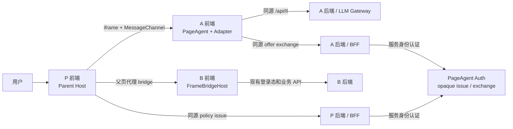

# iframe PageAgent 生产部署手册：P / A / B 职责

本文面向把 PageAgent 部署在跨域助手 iframe 中，并通过父页面代理操作父页面及其明确授权的
跨域业务 iframe 的团队。本文采用以下角色名称：

-   **P（Parent）**：宿主业务页面，拥有父页面 DOM，并运行 `ParentPageControllerHost`。
-   **A（Assistant）**：悬浮助手 iframe，运行 PageAgent、
    `ParentPageControllerAdapter`、审批 UI，并调用 LLM 网关。
-   **B（Business）**：P 中被明确授权的跨域业务 iframe，运行 `FrameBridgeHost`。
-   **Auth（PageAgent 授权服务）**：签发和一次性核销 opaque policy 的服务端组件。它通常由
    PageAgent 平台方运营，不属于浏览器中的 P、A 或 B。

协议与 API 细节参见[父页面控制器桥接](./parent-bridge.zh-CN.md)；普通父页面 PageAgent 操作
跨域子 iframe 的另一种方向参见[跨域 iframe bridge](./cross-origin-iframe-bridge.zh-CN.md)。

## 1. 上线结论和当前边界

生产形态必须保持 `A → P → B`：A 不能直接访问 P 或同级 B 的 `document`，也不能绕过 P
直接寻址 B。P 是唯一 DOM 代理和授权汇合点，B 保留最终业务拒绝权。

当前支持边界：

-   P 只开放 `root` 指定的 DOM 范围，不能默认开放整个 `document`。
-   B 必须是 P 中明确配置、主动接入、跨域的直接子 iframe；不会递归发现孙 iframe。
-   同源 iframe 子文档当前视为 opaque leaf，不读取、不操作，也不自动加入 bridge。
-   未安装 Host、origin 不匹配、policy 无效或 B 未获授权时必须失败关闭；A 只能降级为本地助手。
-   公网和非受控网络必须使用 HTTPS。隔离内网可按下节显式启用 HTTP；两种模式都必须使用精确
    origin、最小 capability 和服务端业务 ACL。
-   Demo server、静态身份、内存 token store、mock TL 响应和 debug 日志不能直接用于生产。

### 受控内网 HTTP 配置

managed-auth 默认拒绝 `http:`。只有确认应用位于隔离内网、没有公网路由，并接受明文传输风险时，
才能在 **Auth 服务端和 P 的 managed-auth client** 同时设置 `allowInsecureHttp: true`：

```ts
// Auth / PageAgent authorization service
const authority = new OpaqueEmbedAuthorizationService({
    store: productionAtomicStore,
    allowInsecureHttp: true,
    assistantOrigin: 'http://assistant.intranet.example:8081',
    allowedParentOrigins: ['http://app.intranet.example:8080'],
    scopeId: 'operations',
    allowedCapabilities: ['observe', 'click', 'input', 'cleanup'],
})

// P browser; the endpoint must remain same-origin with P
const managedAuth = createManagedEmbedAuthClient({
    endpoint: '/api/parent-bridge/embed-policy',
    allowInsecureHttp: true,
    expectedParentOrigin: 'http://app.intranet.example:8080',
    expectedAssistantOrigin: 'http://assistant.intranet.example:8081',
    expectedScopeId: 'operations',
    allowedCapabilities: ['observe', 'click', 'input', 'cleanup'],
})
```

P Host 的 `assistantOrigin`、B target 的 `origin`、B 的 `allowedParentOrigins` 和 A 的
`actualParentOrigin` 校验也必须写成完整且完全相同的 `http://host:port`。底层 bridge 已支持精确
HTTP(S) origin，不需要另一个全局开关；`allowInsecureHttp` 专门防止托管认证在生产中被无意降级。

启用 HTTP 前必须同时满足：

-   P、A、B 都通过 HTTP 加载，或者所有被 HTTPS 页面加载的 iframe 仍使用 HTTPS；浏览器会阻止
    HTTPS P 加载 HTTP A/B 的 mixed content。
-   地址仅在受控私网、VPN 或零信任网络内可达，并用防火墙/网络 ACL、私有 DNS 和设备准入限制
    访问；`allowInsecureHttp` 不会检查一个主机是否真的属于内网。
-   继续使用精确 origin、opaque policy、一次性核销、Host/Adapter source 校验和 B 后端 ACL。
    它们不能防止能够监听或篡改内网流量的中间人。
-   服务端之间仍应尽量使用 TLS/mTLS。若浏览器业务依赖 cookie，要单独验证：HTTP 不能使用
    `Secure` cookie，跨站 iframe 常用的 `SameSite=None` cookie 也要求 `Secure`；无法改造会话
    方案时不应使用 HTTP。
-   在目标浏览器验证 Web Crypto、剪贴板等 Secure Context API。不要因为本地 `localhost` 可用就
    推断普通内网域名或 IP 也具备相同行为。
-   生产仍使用 `debug: false`、短 policy TTL、共享原子 store、审计、限流和 kill switch。

HTTP 是兼容选项，不是安全等价替代。只要部署跨越不可信网络、无线访客网、第三方专线或公网，
就应关闭 `allowInsecureHttp` 并改用 HTTPS。

### 上线阻断项

当前分支在审批请求超时和取消路径仍有一个已复现的空引用问题：Host 调用
`consumeApproval(active.approval)` 后会清空 `active.approval`，随后又访问
`active.approval.resolve(false)`。这会使串行请求队列停住，并产生
`OUTCOME_UNKNOWN`、`getBrowserState TIMEOUT` 和后续连接关闭。

在修复该问题、增加超时/取消回归测试并完成完整 E2E 验收之前，**不得把包含人工审批的版本
直接发布到生产**。相关位置：

-   `packages/page-controller/src/parent-bridge/host.ts` 的请求超时处理；
-   同文件的 `cancelRequest` 处理。

## 2. 生产拓扑和信任边界

以下域名仅为默认 HTTPS 示例；内网 HTTP 模式应把 P/A/B 全部替换为上节冻结的精确 HTTP origin：

-   P：`https://app.example.com`
-   A：`https://assistant.example.com`
-   B：`https://fulfilment.example.com`
-   Auth：仅供 P/A 后端调用的授权服务



Auth policy 只授权“P 可以把某个精确 scope 临时委托给 A”。它不能替代：

-   P 的用户登录、租户隔离和业务 ACL；
-   B 后端对每个真实业务请求的鉴权、CSRF 与幂等校验；
-   P/B 的 `actionPolicy` 和一次性人工审批；
-   CSP、sandbox、XSS 防护、origin/source 校验和版本管理。

## 3. 共同决策：编码前必须冻结的部署合同

P、A、B 和 Auth 负责人应共同评审并记录以下值。任何一项未确定都不应进入生产发布：

| 配置     | 必须确定的内容                                                                |
| -------- | ----------------------------------------------------------------------------- |
| Origin   | P、A、每个 B 的精确 `scheme://host[:port]`，禁止 `*`、`null`、路径和查询串    |
| Scope    | `scopeId`、P 的 `root`、允许暴露的页面区域及 portal 边界                      |
| 身份     | `tenant`、`user`、`targetId` 的服务端来源和审计含义                           |
| 能力     | P Host、policy claims、A requested capabilities、每个 B capability 的最小交集 |
| B 清单   | 稳定 `frameId`、精确 origin、iframe resolver/selector、允许的方法             |
| 风险规则 | 哪些目标 `allow`、`approval_required`、`deny`，审批人是谁、多久超时           |
| 数据分类 | 禁止送给 A/LLM 的字段、文本、URL、属性和业务标识符                            |
| 生命周期 | SPA 路由、root 替换、A/B reload、登录切换、策略撤销时如何 dispose/reconnect   |
| 依赖版本 | 固定 package/IIFE/CSS 版本、协议兼容矩阵、SRI hash 和回滚版本                 |
| SLO      | Auth、LLM、握手和动作超时，失败降级、告警阈值、值班负责人                     |

能力是以下集合的交集，不是任意一方单独声明即可获得：

```text
P Host capabilities
∩ verified policy claims.cap
∩ A requestedCapabilities
∩ A authorizeOffer returned capabilities
∩ P childFrames target capabilities（仅操作 B 时）
∩ B FrameBridgeHost capabilities（仅操作 B 时）
```

`observe` 和 `cleanup` 是 PageAgentCore 的基础能力；启用父页面光标时还需要 `visual`。不需要的
`click`、`input`、`select`、`scroll` 不应预留。

## 4. P 方工作清单

### 4.1 P 前端

P 前端是 DOM 权限的最终所有者，需要完成：

1. 以固定 origin 加载 A；默认使用 HTTPS，内网 HTTP 必须满足第 1 节的显式配置。iframe URL
   中不得出现 policy、用户 token、API key、租户或 target 身份。
2. 按当前严格 profile 配置
   `sandbox="allow-scripts allow-same-origin"`。不要自行增加表单、弹窗、下载或顶层导航权限；
   当前 Host 会拒绝不符合要求的 sandbox。A 的产品设计必须在这个限制内工作。
3. 安装并启动 `ParentPageControllerHost`，固定 `assistantOrigin`、`scopeId`、`root` 和最小
   capabilities。
4. 使用 resolver 返回当前 root；SPA 替换 root、退出登录、切换租户或卸载 iframe 时销毁旧
   Host，禁止旧 session 继续操作新页面。
5. 用 `actionPolicy` 对支付、删除、提交、权限变更、外部导航和跨 B 操作做显式规则；不要按
   可见按钮文案猜测风险。
6. 用 `transformState` 和页面标记继续脱敏。默认抽取不会自动删除所有业务文本、label、URL 和
   ID。
7. 如需操作 B，在 `childFrames.targets` 中逐个配置稳定 ID、iframe resolver、精确 origin 和
   最小 capabilities；禁止自动扫描所有 iframe。
8. 为每个 B 的授权写入 policy claims 的 `childFrames`，验证完成后不得由前端追加 grant。
9. 选择 `visualFeedback: 'non-blocking'` 或 `none`；反馈 DOM 必须保持
   `pointer-events: none`，不能覆盖 A 悬浮窗。
10. 在页面隐藏、导航、root 失效和发布回滚时执行 `host.dispose()`。

最小接线示意：

```ts
const host = new ParentPageControllerHost({
    iframe: document.querySelector<HTMLIFrameElement>('#page-agent-assistant')!,
    assistantOrigin: 'https://assistant.example.com',
    root: () => document.querySelector('#trusted-automation-root'),
    scopeId: 'operations',
    capabilities: ['observe', 'click', 'input', 'cleanup', 'visual'],
    childFrames: {
        targets: [
            {
                id: 'fulfilment-app',
                iframe: () => document.querySelector<HTMLIFrameElement>('#fulfilment-frame'),
                origin: 'https://fulfilment.example.com',
                capabilities: ['observe', 'click', 'input', 'cleanup'],
            },
        ],
    },
    visualFeedback: 'non-blocking',
    getEmbedPolicy: () => managedAuth.getEmbedPolicy(),
    verifyEmbedPolicy: (policy, context) => managedAuth.verifyEmbedPolicy(policy, context),
    actionPolicy: ({ targetContext }) =>
        targetContext.kind === 'child-frame'
            ? { decision: 'approval_required', reason: 'Operate fulfilment application' }
            : { decision: 'allow' },
})

host.start()
```

### 4.2 P 后端

P 后端至少提供一个同源、仅 POST 的 policy issue 路由：

1. 从 P 自己的服务端 session 获取用户、租户和 target，不能信任浏览器提交的同名字段。
2. 执行“当前用户是否允许启用 PageAgent、访问该 root、使用这些 capabilities、操作这些 B”的
   业务 ACL。
3. 调用 Auth 的 `issue`，写入精确 P/A origin、`scopeId`、capabilities、短 TTL 和明确的
   `childFrames` grants。
4. 返回精确 `{ policy, claims }`，设置 `Cache-Control: no-store`；禁止把 policy 写进日志、
   trace、URL、cookie、localStorage 或埋点。
5. 配置 CSRF 防护、请求体大小限制、限流、服务间认证和审计。审计只记录 policy ID、身份、
   scope、能力、结果与时间，不记录原始 opaque token。
6. 当用户退出、权限撤销或 target 失效时停止签发新 policy；短 TTL 控制已经签发的暴露窗口。

### 4.3 P 基础设施与安全响应头

-   CSP `frame-src` 只允许 A 和明确的 B；`script-src`、`connect-src` 继续使用 P 的现有最小策略。
-   协调 A/B 的响应头，不得使用会阻止 P 嵌入它们的 `X-Frame-Options`；P 自身是否允许被其他
    页面嵌入，应按 P 的独立安全策略配置。
-   使用固定版本资源；IIFE 与 CSS 必须来自同一版本。走 CDN 时生成并校验 SRI，禁止 `latest`。
-   增加 P 级 feature flag/kill switch，可立即停止 Host、移除 B grant 或收紧 capability。
-   多租户系统必须分别配置 origin、scope 和 ACL，不能使用全局“所有租户均允许”开关。

### 4.4 P 验收证据

-   A 只能观察 root 内数据，看不到 root 外 DOM、P 密钥、非授权 iframe 和 portal。
-   错误 A origin、错误 source、同源 iframe、兄弟 A iframe 和过期/重放 policy 均失败关闭。
-   没有 `childFrames` claim 时，B 内容不可见、不可操作。
-   P 的 `deny` 不能被 A 审批或 B allow 覆盖。
-   root 替换和登录切换后旧 index/session 失效。

## 5. A 方工作清单

### 5.1 A 前端

A 负责 Agent、用户输入和人工审批体验，需要完成：

1. 把助手部署到固定 origin，并通过 CSP `frame-ancestors` 只允许明确的 P origins；HTTP 仅限已
   启用 `allowInsecureHttp` 的受控内网模式。
2. 创建 `ParentPageControllerAdapter`，`requestedCapabilities` 只请求产品实际使用的能力。
3. `authorizeOffer` 先比较浏览器实际观察到的 P origin，再把 opaque policy 和完整 offer 发给
   A 的同源后端核销。
4. 后端返回后，再次精确比较 `policyId`、P/A origin、session、challenge、frame/host instance
   和 capability 顺序；不能只检查 HTTP 200。
5. `onApprovalRequired` 必须显示脱敏后的 method、capability、target/frame 和业务原因；只允许
   `Allow once` 或 `Deny`，禁止批量自动批准。
6. 审批 UI 绑定单个 `approvalId`/`requestId`；超时、导航、连接关闭、页面卸载都按拒绝处理。
7. 用 Adapter 创建 PageAgentCore/PageAgent。用户任务输入必须在每次执行时读取当前值，不能
   继续使用写死指令。
8. 当 Host 不可用、policy 被拒绝或 bridge 失效时进入明确降级态，只保留 A 本地能力；禁止尝试
   直接访问 `parent.document`。
9. 任务结束、停止、路由切换和 iframe 卸载时依次 stop、清理视觉状态并 dispose。
10. 生产必须设置 `debug: false`、`includeRawHistory: false`，UI 只展示经过映射和脱敏的历史。

最小 Adapter 要点：

```ts
const adapter = new ParentPageControllerAdapter({
    requestedCapabilities: ['observe', 'click', 'input', 'cleanup', 'visual'],
    authorizeOffer: async (offer, actualParentOrigin, signal) => {
        if (actualParentOrigin !== 'https://app.example.com' || signal.aborted) return undefined
        const response = await fetch('/api/parent-bridge/authorize-offer', {
            method: 'POST',
            credentials: 'same-origin',
            cache: 'no-store',
            headers: { 'Content-Type': 'application/json' },
            signal,
            body: JSON.stringify({ policy: offer.policy, actualParentOrigin, offer }),
        })
        if (!response.ok) return undefined
        return mapAndRevalidateAuthorizationContext(
            await response.json(),
            offer,
            actualParentOrigin
        )
    },
    onApprovalRequired: (request) => approvalUi.requestOneUseDecision(request),
})
```

`mapAndRevalidateAuthorizationContext` 和 `approvalUi` 由 A 应用实现；前者必须完成上文列出的逐字段
绑定校验，后者必须保证每次决定只对应一个待审批请求。

### 5.2 A 后端

A 后端需要提供两类能力：

**Offer 核销接口**

1. 提供同源 `POST /api/parent-bridge/authorize-offer`，限制请求体大小并设置 `no-store`。
2. 认证 A 用户 session；如果 P/A 使用统一身份，校验 A 当前用户与 policy 中用户/租户的一致性。
3. 通过服务身份调用 Auth `exchange`，提交原始 policy、浏览器观察到的 `actualParentOrigin` 和完整
   offer。
4. Auth 必须原子消费 token；重放、过期、错误绑定和能力扩大都返回拒绝。
5. 只返回短期 `authorizationContext`，不回显 policy；错误信息不得泄漏 token 是否存在以外的
   敏感细节。

**LLM 网关**

1. A 浏览器只调用同源绝对地址，例如 `https://assistant.example.com/api/tl`。
2. 模型 API key、长期 Bearer 和上游服务凭据只保留在服务端；禁止通过 `/api/env-config`、bundle
   或 iframe URL 下发。
3. 在网关执行用户、租户、模型、配额、并发、超时、输入大小和成本控制。
4. 支持请求取消和 SSE 断开；PageAgent stop 后应终止上游请求，避免后台继续计费或执行。
5. 日志默认不记录完整 prompt、页面状态、模型原始响应、policy 或用户输入；需要诊断时使用受控
   采样、脱敏和短保留期。
6. 对模型不可用、限流和超时提供可见错误，不要回退到不受控的浏览器直连模型。

### 5.3 A 浏览器策略

-   CSP `frame-ancestors` 精确允许 P，`connect-src` 只允许 A 同源网关和必要资源。
-   A 不应依赖 iframe 内表单提交、弹窗、下载或顶层导航；当前严格 sandbox 不提供这些能力。
-   如果 P/A 跨站且依赖 cookie，必须在目标浏览器验证第三方 cookie/分区 cookie 策略；不能假设
    开发环境 cookie 行为会在生产浏览器保持一致。
-   A 的业务 session 过期时停止任务并重新认证，不能继续使用旧的 bridge 授权上下文。

### 5.4 A 验收证据

-   任意自定义任务确实送给真实 LLM，而不是 mock 固定动作。
-   A 看不到未授权 B、P root 外内容和原始 opaque token 日志。
-   `Allow once` 只能放行当前请求；重复响应、过期响应和篡改响应无效。
-   `OUTCOME_UNKNOWN` 后 A 先重新观察并提示用户，不自动重放修改动作。
-   Auth/LLM/P Host 不可用时 A 显示明确降级状态，且不会无限重试。

## 6. B 方工作清单

### 6.1 B 前端

B 是自身业务页面和数据的最终防线，需要完成：

1. 在明确的直接跨域 iframe 页面中安装并启动 `FrameBridgeHost`；B 不安装 PageAgent，也不调用
   LLM。
2. `allowedParentOrigins` 只列最终 P origins，不能信任 A origin、`*` 或 URL 参数提供的 origin。
3. capabilities 只声明 B 愿意接受的方法；与 P 的 B target 配置和 policy grant 保持一致。
4. 用 scoped PageController/root 只暴露需要自动化的业务区域；使用 `transformState` 删除仍可能
   泄漏的文本、URL、ID 和属性。
5. 使用 `data-page-agent-policy="confirm|deny"` 和/或 B 自己的 `actionPolicy` 标注支付、删除、
   提交、权限变更等动作。B 的 deny 是最终结果，P/A 都不能覆盖。
6. prepare 阶段只处理脱敏摘要；批准后才允许 P 使用短时、一次性的 prepared action token
   commit。导航、目标变化和 tree revision 变化必须使旧 token 失效。
7. B reload、SPA 卸载或登录切换时 dispose 旧 Host，并为新页面生成新的 frame instance。
8. B 页面中的敏感字段使用 `data-page-agent-sensitive`，但仍应以 `transformState` 和后端 ACL
   作为真正防线。

示意：

```ts
import { FrameBridgeHost, PageController } from '@page-agent/page-controller/iframe-bridge'

const controller = new PageController({
    root: document.querySelector('#fulfilment-automation-root')!,
    includeAttributes: ['id', 'aria-label'],
})

const host = new FrameBridgeHost({
    controller,
    allowedParentOrigins: ['https://app.example.com'],
    capabilities: ['observe', 'click', 'input', 'cleanup'],
    actionPolicy: ({ target }) =>
        target?.matches('[data-destructive]')
            ? { decision: 'deny', reason: 'Destructive operation is not automated' }
            : target?.matches('[data-sensitive-submit]')
              ? { decision: 'approval_required', reason: 'Sensitive business submission' }
              : { decision: 'allow' },
})

host.start()
window.addEventListener('pagehide', () => host.dispose(), { once: true })
```

### 6.2 B 后端

B 不接触 parent-bridge opaque policy，但必须继续执行正常业务安全控制：

1. 每个业务 API 仍校验 B 自己的用户 session、租户、对象权限、CSRF 和业务状态；不能因为按钮
   来自 bridge 点击就跳过后端鉴权。
2. 高风险 mutation 使用幂等键、版本号或业务状态机，降低 `OUTCOME_UNKNOWN` 后人工确认和恢复
   的成本。
3. 记录“自动化触发”的业务审计元数据，但不要记录原始页面状态、模型 prompt 或敏感输入。
4. 对批量、频繁或异常自动化操作设置速率、额度和风控规则。
5. 如果 B 跨站并依赖 cookie，验证 iframe 中的 SameSite、Secure、分区 cookie 或替代 session
   方案；所有目标浏览器都需要预生产实测。

### 6.3 B 基础设施和验收

-   CSP `frame-ancestors` 精确允许 P；P 的 `frame-src` 同时允许 B。
-   不设置阻止 P 嵌入的 `X-Frame-Options`；禁止 mixed content。
-   验证未配置的同 origin B sibling 不会被发现或操作。
-   验证 B deny 不能被 P actionPolicy 或 A 人工审批覆盖。
-   验证 B reload、目标替换和 prepared token 重放全部失败，重新 observe 后才能继续。

## 7. Auth / PageAgent 平台方工作清单

推荐的同公司部署使用一次性 opaque policy：

1. 部署 `OpaqueEmbedAuthorizationService` 或等价实现，固定 issuer、audience、协议版本、P/A
   origins、scope 和最大 capabilities。
2. 使用至少 256-bit 随机 policy，只存 SHA-256 摘要；不得持久化或日志记录原始 token。
3. 把 `InMemoryOpaqueEmbedAuthorizationStore` 替换成 Redis、数据库事务或等价的共享原子 TTL
   store。
4. `putIfAbsent` 必须防冲突；`consume` 必须在 claims 与 offer 全部匹配后原子删除，错误绑定不能
   提前烧掉本来有效的 token。
5. P issue 与 A exchange 调用使用 mTLS、服务 token 或等价的服务身份认证，不能开放为匿名公共
   API。
6. 使用短 TTL，并保证各节点时钟同步；提供签发、核销、重放、过期、origin mismatch、capability
   denied 的指标和告警。
7. 服务多实例、跨可用区时验证原子消费和一致性；故障时失败关闭，不允许临时跳过在线核销。
8. 预留 ES256/JWKS 升级路径，但不要同时接受无法区分类型的任意 token。数字签名本身仍不能
   替代一次性 `jti` 消费。

## 8. CSP、sandbox 和网络配置矩阵

| 方   | 必须允许                                                       | 必须限制                                                      |
| ---- | -------------------------------------------------------------- | ------------------------------------------------------------- |
| P    | `frame-src` A 和明确 B；自身脚本/CSS/CDN                       | 禁止 wildcard frame；A sandbox 不增加额外 token               |
| A    | `frame-ancestors` P；`connect-src` A 同源 Auth BFF/LLM gateway | 不直连模型，不接收任意 P origin，不在 URL 带 policy           |
| B    | `frame-ancestors` P；自己的业务 API                            | 不信任 A origin，不向 A 暴露业务 token，不开放未需 capability |
| Auth | 仅 P/A 后端服务身份                                            | 不允许浏览器匿名直连，不记录原始 policy                       |

推荐 iframe 骨架：

```html
<iframe
    id="page-agent-assistant"
    src="https://assistant.example.com/embed"
    sandbox="allow-scripts allow-same-origin"
    referrerpolicy="strict-origin-when-cross-origin"
></iframe>
```

不要把 CORS 当作 bridge 授权。浏览器 `postMessage`/MessageChannel 的 origin/source 校验、后端
认证、policy 和 CSP 是不同层次，必须同时存在。

## 9. 可观测性和日志

P、A、B、Auth 应使用可关联但不含敏感载荷的日志字段：

-   `policyId`/`jti`、session ID 的脱敏或散列形式；
-   P/A/B origin、scope、frame ID、method、capability；
-   issue/exchange/handshake/request/approval 的开始、结果、耗时和错误码；
-   B available/unavailable、tree revision 变化、root replacement；
-   `OUTCOME_UNKNOWN`、`STALE_TREE`、`POLICY_EXPIRED`、`APPROVAL_TIMEOUT` 和连接关闭计数；
-   LLM 请求耗时、token/cost 统计和取消结果，但不记录完整 prompt/response。

禁止记录：

-   原始 opaque policy、Bearer、cookie、API key；
-   页面完整 DOM/BrowserState、输入文本、密码、验证码；
-   完整模型 prompt/response、SSE chunk 和 raw history；
-   未脱敏的 authorizationContext 或审批 payload。

Demo 为排障默认开启 debug 不代表生产设置。生产构建必须明确覆盖为 `debug: false`，并通过配置
检查或启动日志证明生效。

## 10. 部署顺序

建议按以下依赖顺序发布；存在依赖的跨团队发布不要并行推进：

1. **修复上线阻断项**：审批超时/取消路径、相应单元测试和 E2E 必须先合入。
2. **冻结合同**：确认 origins、scope、root、capabilities、B IDs、审批规则和回滚开关。
3. **部署 Auth**：共享原子 store、服务身份、短 TTL、监控和容量测试先就绪。
4. **部署 B**：Host、最小 root/capability、业务策略和后端 ACL；默认可保持未被 P grant。
5. **部署 A 后端**：offer exchange、同源 LLM gateway、配额、脱敏和取消机制。
6. **部署 A 前端**：Adapter、真实 LLM、自定义指令、审批 UI 和降级状态，先不被生产 P 嵌入。
7. **部署 P 后端**：issue 路由、用户/租户/target ACL、childFrames grant 和审计。
8. **部署 P 前端**：Host、A iframe、B targets、CSP 和 feature flag，先对内部租户灰度。
9. **预生产验收**：使用与生产一致的协议、域名、CSP、cookie、网关和真实 LLM；HTTP 模式不能
   只用具有特殊安全待遇的 `localhost` 代替内网域名验证。
10. **逐步放量**：内部用户 → 单租户 → 小比例租户 → 全量；每阶段观察错误率和人工审批。

## 11. 生产验收矩阵

### 正向场景

-   A 使用任意自定义指令操作 P root 内的允许控件。
-   A 观察并操作 policy 明确授权、P 配置且 B 主动接入的 B。
-   敏感动作显示一次审批；allow 后只执行一次，deny 后不执行。
-   PageAgent 停止、完成和页面卸载后高亮、光标、连接与请求均清理。
-   A/LLM 网关使用真实模型和同源请求，不使用 mock 固定动作。

### 负向与故障场景

-   错误 origin/source、兄弟 A、同源 iframe、opaque `null` origin 被拒绝。
-   未配置 `allowInsecureHttp` 时任意 HTTP Auth service/client 配置启动即失败；开启后仍拒绝未列入
    allow-list 的 HTTP origin、错误端口和错误协议。
-   policy 篡改、过期、重放、错误 tenant/target/scope/capability 被拒绝。
-   P 未授权 `childFrames`、未配置 B、错误 B origin、B 未启动 Host 时不可见或 unavailable。
-   P deny、B deny 均不能被 A 的 allow 覆盖。
-   root 替换、A/B reload、tree revision 变化使旧 index 和 prepared action 失效。
-   Auth、LLM、P Host、B Host 超时或断开时失败关闭且 A 能明确降级。
-   `OUTCOME_UNKNOWN` 后不自动重放，重新观察并由用户确认真实业务状态。
-   审批无响应、取消和导航路径能正常 settle，Host 队列不会被永久堵塞。
-   CSP、sandbox、第三方 cookie 和移动端浏览器行为均在真实域名验证。

### 必跑检查

```bash
npm run build
npm run typecheck
npm run lint
npm test
npm run test:e2e
```

此外应增加不进入普通 CI 的真实 LLM smoke test：输入一条与 Demo 默认任务不同的指令，验证模型
只执行指令要求的目标，并检查调用确实到达真实 LLM gateway。

## 12. 回滚和应急处理

回滚必须优先收紧授权，而不是扩大 allow-list：

1. P 关闭 feature flag，停止创建 Host 或移除对应 B target/grant。
2. P 后端停止为受影响 scope/capability 签发新 policy。
3. Auth 保持在线核销并缩短新 token TTL；不要关闭验证器以“恢复可用性”。
4. A 降级为本地助手并禁用父页面动作，保留明确错误提示。
5. B 保留业务后端 ACL；必要时把高风险 actionPolicy 改为 deny。
6. 回滚到上一组兼容的 Host/Adapter/FrameHost 固定版本，不能混搭未知协议版本。
7. 对 `OUTCOME_UNKNOWN` 事件先核对业务状态和审计记录，再决定人工补偿，禁止自动重放。

安全事件中如怀疑 policy 泄漏，应停止签发、撤销相关 P/A 服务身份、检查 Auth 核销审计和受影响
target；opaque token 不可解析不代表泄漏后无风险。

## 13. 各方最终交付物

### P 方

-   [ ] Host 前端接线、root/capability/actionPolicy/childFrames 配置；
-   [ ] A iframe、严格 sandbox、P CSP 与固定版本资源；
-   [ ] 同源 policy issue 路由和完整业务 ACL；
-   [ ] feature flag、监控、审计和回滚方案；
-   [ ] root 外数据不可见及错误 source/origin 的安全测试。

### A 方

-   [ ] Adapter、严格 offer revalidation、一次性审批 UI；
-   [ ] 可编辑自定义指令、真实 PageAgent/LLM 执行和显式降级状态；
-   [ ] 同源 offer exchange 路由和 LLM gateway；
-   [ ] stop/dispose/abort 生命周期及敏感日志脱敏；
-   [ ] 生产 `debug: false`、`includeRawHistory: false` 的配置证据。

### B 方

-   [ ] FrameBridgeHost、精确 P origins、最小 root/capabilities；
-   [ ] B actionPolicy、confirm/deny 标记和 transformState；
-   [ ] B 后端 ACL、CSRF、幂等、风控和业务审计；
-   [ ] CSP `frame-ancestors`、iframe cookie 兼容验证；
-   [ ] reload、prepared token 重放、未配置 sibling 和 deny 优先级测试。

### Auth / PageAgent 平台方

-   [ ] 共享原子 TTL store 和至少 256-bit opaque policy；
-   [ ] P issue/A exchange 服务认证、精确绑定和短 TTL；
-   [ ] 重放/过期/origin/capability 指标、告警与容量测试；
-   [ ] 不记录原始 token，失败关闭，多实例原子性验证；
-   [ ] ES256/JWKS 升级设计和版本化迁移边界。

## 14. Demo 到生产的禁止复制项

-   不部署 `packages/e2e/server.mjs`。
-   不暴露 `/api/env-config` 或把 API key 编译进浏览器 bundle。
-   不使用静态 demo tenant/user/target。
-   不使用 `InMemoryOpaqueEmbedAuthorizationStore`。
-   不使用 `PARENT_BRIDGE_DEMO_MOCK_TL=1` 作为真实模型验收。
-   不保留 Demo 的 `debug: true` 或完整 console/network trace。
-   不复制 `127.0.0.1` allow-list、HTTP URL、示例 SRI hash 或宽泛 capabilities。
-   不因上线故障临时关闭 origin、policy、sandbox、actionPolicy 或 B deny 校验。
