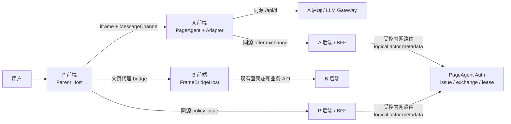

# iframe PageAgent 生产部署手册：P / A / B 职责

本文面向把 PageAgent 部署在跨域助手 iframe 中，并通过父页面代理操作父页面及其明确授权的
跨域业务 iframe 的团队。本文采用以下角色名称：

> **权威架构入口：** P / A / B 与公共 Auth 的最新拓扑、职责边界、主体/服务身份、精确请求流、
> 数据模型和 V1/V2 边界见[《P / A / B 与公共 Auth 权威架构》](./parent-bridge-auth-architecture.zh-CN.md)。
> 本手册是部署操作清单；授权架构出现冲突时以上述文档为准。本仓库已落地 integration-aware
> 一次性 Grant 合同、领域引擎、浏览器接线与测试实现；实际 SSO、ActiveLease、P/A BFF 轮询、
> Redis/数据库和 HA 的生产 Auth 必须在独立服务仓库部署，目前不能视为已上线。
>
> 未冻结的架构与生产问题、处理状态和 release gate 证据统一记录在
> [《P / A / B / Auth 架构待决事项台账》](./parent-bridge-architecture-open-issues.zh-CN.md)。
> 已冻结的 V1 P0 默认值与风险接受见
> [ADR-0001](./adr/0001-parent-bridge-auth-v1-p0-baseline.zh-CN.md)。

-   **P（Parent）**：宿主业务页面，拥有父页面 DOM，并运行 `ParentPageControllerHost`。
-   **A（Assistant）**：悬浮助手 iframe，运行 PageAgent、
    `ParentPageControllerAdapter`、审批 UI，并调用 LLM 网关。
-   **B（Business）**：P 中被明确授权的跨域业务 iframe，运行 `FrameBridgeHost`。
-   **Auth（PageAgent 授权服务）**：签发和一次性核销 opaque policy 的服务端组件。它通常由
    PageAgent 平台方运营，不属于浏览器中的 P、A 或 B。

协议与 API 细节参见[父页面控制器桥接](./parent-bridge.zh-CN.md)；普通父页面 PageAgent 操作
跨域子 iframe 的另一种方向参见[跨域 iframe bridge](./cross-origin-iframe-bridge.zh-CN.md)。

## 1. 上线结论和当前边界

生产形态必须保持 `A → P → B`：A 不能直接访问 P 或同级 B 的 `document`，也不能绕过 P
直接寻址 B。P 是唯一 DOM 代理和授权汇合点，B 保留最终业务拒绝权。

当前支持边界：

-   P 只开放 `root` 指定的 DOM 范围，不能默认开放整个 `document`。
-   B 必须是 P 中明确配置、主动接入、跨域的直接子 iframe；不会递归发现孙 iframe。
-   同源 iframe 子文档当前视为 opaque leaf，不读取、不操作，也不自动加入 bridge。
-   未安装 Host、origin 不匹配、policy 无效或 B 未获授权时必须失败关闭；A 只能降级为本地助手。
-   公网和非受控网络必须使用 HTTPS。隔离内网可按下节显式启用 HTTP；两种模式都必须使用精确
    origin、最小 capability 和服务端业务 ACL。
-   本目标 V1 的 P/A BFF→Auth 没有 mTLS、service JWT、调用方认证或应用级 actor 强制校验；
    actor 只是双边固定配置、路由和审计元数据。任何能访问 Auth 的内网服务都能冒充 P/A，这是
    已接受但必须显式登记的剩余风险。
-   Demo server、静态身份、内存 token store、mock TL 响应和 debug 日志不能直接用于生产。

### 受控内网 HTTP 配置

integration-aware Auth 默认拒绝 `http:`。只有确认应用位于隔离内网、没有公网路由，并接受明文
传输风险时，才能由 **Auth 全局风险门、对应 Integration 和 P browser client** 三方同时启用：

```ts
// Independent Auth service; productionRegistry/store implement the exported contracts.
const authority = new IntegrationAwareEmbedAuthorizationAuthority({
    registry: productionRegistry,
    store: productionAtomicStore,
    issuer: 'page-agent-auth',
    allowInsecureHttp: true,
})

// The registered Integration also uses transportMode: 'trusted-intranet-http'
// and exact P/A/B HTTP origins.

// P browser; the endpoint must remain same-origin with P
const managedAuth = createIntegrationAwareManagedEmbedAuthClient({
    endpoint: '/api/parent-bridge/embed-policy',
    allowInsecureHttp: true,
    expectedIntegrationId: 'p-operations__shared-assistant',
    expectedParentAppId: 'p-operations',
    expectedAssistantAppId: 'shared-assistant',
    expectedParentOrigin: 'http://app.intranet.example:8080',
    expectedAssistantOrigin: 'http://assistant.intranet.example:8081',
    expectedScopeId: 'operations',
    expectedIssuer: 'page-agent-auth',
    allowedCapabilities: ['observe', 'click', 'input', 'cleanup'],
})
```

P Host 的 `assistantOrigin`、B target 的 `origin`、B 的 `allowedParentOrigins` 和 A 的
`actualParentOrigin` 校验也必须写成完整且完全相同的 `http://host:port`。底层 bridge 已支持精确
HTTP(S) origin，不需要另一个全局开关；`allowInsecureHttp` 专门防止托管认证在生产中被无意降级。

启用 HTTP 前必须同时满足：

-   P、A、B 都通过 HTTP 加载，或者所有被 HTTPS 页面加载的 iframe 仍使用 HTTPS；浏览器会阻止
    HTTPS P 加载 HTTP A/B 的 mixed content。
-   地址仅在受控私网、VPN 或零信任网络内可达，并用防火墙/网络 ACL、私有 DNS 和设备准入限制
    访问；`allowInsecureHttp` 不会检查一个主机是否真的属于内网。
-   继续使用精确 origin、opaque policy、一次性核销、Host/Adapter source 校验和 B 后端 ACL。
    它们不能防止能够监听或篡改内网流量的中间人。
-   本目标 V1 的 P/A BFF→Auth 同样处在受控内网 HTTP 风险接受范围内，没有 mTLS 或 service JWT；
    网络 ACL 只能缩小可达面，不能证明调用方应用身份。若浏览器业务依赖 cookie，要单独验证：
    HTTP 不能使用 `Secure` cookie，跨站 iframe 常用的 `SameSite=None` cookie 也要求 `Secure`；
    无法改造会话方案时不应使用 HTTP。
-   在目标浏览器验证 Web Crypto、剪贴板等 Secure Context API。不要因为本地 `localhost` 可用就
    推断普通内网域名或 IP 也具备相同行为。
-   生产仍使用 `debug: false`、policy TTL 120 秒（硬上限 300 秒）、固定 900 秒 ActiveLease、共享
    原子 store、审计、限流和 kill switch。

HTTP 是兼容选项，不是安全等价替代。只要部署跨越不可信网络、无线访客网、第三方专线或公网，
就应关闭 `allowInsecureHttp` 并改用 HTTPS。

### 已修复的仓内阻断项

审批请求 timeout/cancel 路径曾在清空 `active.approval` 后再次访问它，导致串行请求队列停住。
Host 现已在消费前保存待决 approval，并保证取消、超时和后续排队请求均能 settle；对应单元回归
测试已经加入。

这项代码阻断已经解除，但生产上线仍必须执行本手册的完整审批 E2E、故障注入和真实浏览器验收。
回归覆盖位置：

-   `packages/page-controller/src/parent-bridge/host.ts` 的请求超时处理；
-   同文件的 `cancelRequest` 处理。

## 2. 生产拓扑和信任边界

以下域名仅为默认 HTTPS 示例；内网 HTTP 模式应把 P/A/B 全部替换为上节冻结的精确 HTTP origin：

-   P：`https://app.example.com`
-   A：`https://assistant.example.com`
-   B：`https://fulfilment.example.com`
-   Auth：仅供 P/A 后端调用的授权服务



这张图和本文后续代码都只展示一个运行时切片，不表示生产环境只能有一个 P、一个 A iframe
实例或一个 B。

### 生产基数与运行时隔离

-   每个环境只有一个逻辑 A 系统（一个登记的 AssistantApp 和一套产品能力），但它可以有多个
    HA 后端副本；每个 P 页面中的 A iframe 都是独立的浏览器文档和运行时实例。多个 P、同一 P
    的多个租户，以及同一浏览器中的多个标签页，可以同时嵌入这个逻辑 A。
-   Integration 按 `parentApp × assistantApp × environment × scope` 定义。租户默认属于 canonical
    subject/session，不因租户数量增加而复制 Integration；只有 scope 或应用/环境边界变化时才登记
    对应的 Integration 配置。
-   每个 P Host 与其绑定的 A iframe 运行时拥有独立 bridge 状态和一个独立的
    integration-aware auth client。一个 bridge session 只绑定一个 canonical subject/租户、一个
    Integration、一个 `scopeId`、一个 `targetId` 和一组 session/instance 标识；不能把一个连接
    改作另一个租户、scope、target 或 iframe 实例使用。
-   bridge activation、binding、policy/context 和当前 session 只保存在对应运行时内存中，不写入
    共享 `localStorage`。同源 A iframe 可以共享登录 JWT 的浏览器登录态，但 JWT 不能标识某个
    bridge 实例、租户、scope、target 或 session。
-   一个 P/Integration 可以登记多个 B ChildTarget。P BFF 按当前 canonical tenant、业务 target
    和 ACL 选择当前 Grant 的 B 子集；单个 Grant 最多包含 8 个 B target。模型多步以及在获准 B
    之间切换都复用现有 bridge session，不为每个 B 或每次模型调用重新握手。
-   实际权限始终是以下交集，B 的最终拒绝不能被 P 或 A 放宽：

    ```text
    Integration maximum
    ∩ P BFF tenant/business ACL
    ∩ Grant subset
    ∩ B final ACL
    ```

多个 scope 必须分别使用匹配的 Integration、Host 配置和 bridge 连接。当前合同不支持一个连接
跨 scope，也不提供把多个 scope 动作提交为一个原子事务的 API；业务流程只能分别授权、分别执行，
并自行处理部分成功。

Auth policy 只授权“P 可以把某个精确 scope 临时委托给 A”。它不能替代：

-   P 的用户登录、租户隔离和业务 ACL；
-   B 后端对每个真实业务请求的鉴权、CSRF 与幂等校验；
-   P/B 的 `actionPolicy` 和一次性人工审批；
-   CSP、sandbox、XSS 防护、origin/source 校验和版本管理。

### V1 服务调用边界与剩余风险

-   浏览器只能调用自身同源 BFF：P runtime 调 P BFF，A runtime 调 A BFF。Auth 不对浏览器开放，
    CSP、路由和网络 ACL 都必须阻断 browser→Auth 直连。
-   P/A BFF→Auth 在当前受控内网 V1 中没有 mTLS、service JWT、caller authentication 或应用级
    actor enforcement。请求中的 actor 必须来自双方固定的环境配置，只用于配置选择、路由和审计，
    不校验实际调用方或方向真伪，不作为身份、授权或请求拒绝依据，也不能接受浏览器传入值。
-   因此任何获得 Auth 网络可达性的内部服务都可以使用已知配置冒充 P 或 A。网络隔离、最小可达
    列表、审计和告警只能降低暴露，不能消除这一剩余风险；若环境无法接受，必须在后续版本增加
    调用方认证，而不是把 logical actor 描述成认证机制。
-   canonical subject 必须严格比较 `{ issuer, tenant, user }` 三元组；P BFF 还必须从受保护的
    服务端 session/路由上下文推导 `targetId`、`scopeId`、Integration 和 ACL，不能信任浏览器自报。

### 首次连接与重连时机

-   P 调用 `host.start()` 后默认只监听，不申请 policy、不调用 Auth、不发送 offer。
-   A 必须显示“连接”按钮或等价的清楚操作；用户触发后调用 `adapter.connect()`，A 先发送不含
    身份/policy 的 `handshake-request`，P 才执行 P BFF issue，随后 A BFF exchange。
-   一次成功握手对应一个 bridge session，不对应一次模型调用。模型多步和动作复用现有
    `MessageChannel`。
-   首次成功后才建立仅内存 activation。其有效期间 P 可调用 `host.reconnect()` 或自动发送
    reconnect offer，A 可调用 `adapter.reconnect()`；每次重连仍签发新 policy 并完整校验。生产
    reconnect 还必须保持原 ActiveLease 的固定 `expiresAt`，不得创建滚动 900 秒 lease 变相续租；
    rebind/退避/竞态 API 仍属于 AUTH-010 P1 合同。
-   登出、切换用户/租户/target、配置撤销、显式停用或新的 A 文档加载必须清除 activation；之后
    只能再次由 A 用户点击。A 调 `adapter.deactivate()` 会通知 P 清除；P 调
    `host.deactivate()` 也会通知 A 清除，控制消息不回环。
-   “按钮点击”是产品行为，不是可信的密码学 user gesture 证明。P BFF 必须照常校验 P 会话、
    CSRF、target 和业务 ACL，不能信任 `reason: 'user'` 自报授权。

### ActiveLease 生命周期（生产 P0 合同）

成功 exchange 必须在 Auth 的共享原子 store 中同时创建 `ACTIVE` lease；这是生产运行时继续操作的
授权依据，不是浏览器本地 activation 的别名。V1 lease 固定为 900 秒，不续期；policy TTL 固定为
120 秒且不得超过 300 秒，lease/context 不得超过 3600 秒或上游凭据剩余寿命，时钟偏差预算为
5 秒。

-   P runtime 每 30 秒 ±20% jitter（即每 24–36 秒）只轮询同源 P BFF；A runtime 以同样节奏只
    轮询同源 A BFF。两个 BFF 分别查询 Auth，浏览器不能直接轮询 Auth。
-   任一侧收到 `REVOKED` 或 `EXPIRED` 必须立即失败关闭；连续 90 秒没有获得明确、肯定的
    `ACTIVE` 结果（包括超时、网络错误和 unknown）也必须失败关闭。
-   失败关闭必须清除 activation/连接，安全 abort 或 settle 所有 pending request、审批和模型任务，
    且禁止自动 reconnect。恢复只能由 A 用户再次显式 `connect()`，重新完成 issue、exchange 并
    创建新的 lease。
-   logout、user/tenant/target/scope 变化、权限或 config disable、Integration 禁用和 kill switch
    都必须由相应 BFF/Auth 撤销 lease。`host.deactivate()`/`adapter.deactivate()` 只是浏览器清理
    信号，不能替代 Auth 中的 revoke，也不能作为撤销成功证据。

**当前实现缺口：** 本仓库现有 integration-aware 合同只覆盖一次性 Grant 的
issue/consume/revoke，没有 ActiveLease 状态机、固定 900 秒 lease、P/A BFF status endpoint 或
浏览器轮询接线。以上是独立生产 Auth/BFF/runtime 必须补齐并通过发布门禁的 P0 合同，不能从当前
library API 推断它已经可用。

## 3. 共同决策：编码前必须冻结的部署合同

P、A、B 和 Auth 负责人应共同评审并记录以下值。任何一项未确定都不应进入生产发布：

| 配置        | 必须确定的内容                                                                            |
| ----------- | ----------------------------------------------------------------------------------------- |
| Origin      | P、A、每个 B 的精确 `scheme://host[:port]`，禁止 `*`、`null`、路径和查询串                |
| Integration | `parentAppId × assistantAppId × environment × scopeId` 的唯一映射和 configVersion         |
| Scope       | `scopeId`、P 的 `root`、允许暴露的页面区域及 portal 边界                                  |
| 身份        | canonical subject/session 中的 `tenantId`、user，以及 `targetId` 的服务端来源和审计含义   |
| 能力        | P Host、policy claims、A requested capabilities、每个 B capability 的最小交集             |
| B 清单      | 多个稳定 ChildTarget/`frameId`、精确 origin、resolver、能力，以及单 Grant ≤ 8 的选择规则  |
| 实例隔离    | 每个 Host/A iframe 的 auth client、内存状态、session/instance 标识及清理责任              |
| 服务调用    | P/A logical actor 双边固定值、Auth 网络可达列表、无调用方认证的剩余风险接受               |
| 时效        | policy 120 秒/最大 300 秒；lease 固定 900 秒、不续期、最大 3600 秒且不超过凭据；skew 5 秒 |
| Lease 轮询  | P/A 各经自身 BFF 每 30 秒 ±20%（24–36 秒）；90 秒无肯定 ACTIVE 即失败关闭                 |
| 风险规则    | 哪些目标 `allow`、`approval_required`、`deny`，审批人是谁、多久超时                       |
| 数据分类    | 禁止送给 A/LLM 的字段、文本、URL、属性和业务标识符                                        |
| 生命周期    | SPA 路由、root 替换、A/B reload、登录切换、策略撤销时如何 dispose/reconnect               |
| 依赖版本    | 固定 package/IIFE/CSS 版本、协议兼容矩阵、SRI hash 和回滚版本                             |
| SLO         | Auth、LLM、握手和动作超时，失败降级、告警阈值、值班负责人                                 |

能力是以下集合的交集，不是任意一方单独声明即可获得：

```text
P Host capabilities
∩ verified policy claims.cap
∩ A requestedCapabilities
∩ A authorizeOffer returned capabilities
∩ P childFrames target capabilities（仅操作 B 时）
∩ B FrameBridgeHost capabilities（仅操作 B 时）
```

`observe` 和 `cleanup` 是 PageAgentCore 的基础能力；启用父页面光标时还需要 `visual`。不需要的
`click`、`input`、`select`、`scroll` 不应预留。

上面的 capability 交集是运行时方法门禁；业务数据和对象层面的最终权限还必须服从上一节的
Integration maximum、P BFF tenant/business ACL、Grant 子集和 B 最终 ACL 四层交集。

## 4. P 方工作清单

### 4.1 P 前端

P 前端是 DOM 权限的最终所有者，需要完成：

1. 以固定 origin 加载 A；默认使用 HTTPS，内网 HTTP 必须满足第 1 节的显式配置。iframe URL
   中不得出现 policy、用户 token、API key、租户或 target 身份。
2. 按当前严格 profile 配置
   `sandbox="allow-scripts allow-same-origin"`。不要自行增加表单、弹窗、下载或顶层导航权限；
   当前 Host 会拒绝不符合要求的 sandbox。A 的产品设计必须在这个限制内工作。
3. 为每个 A iframe 运行时安装独立的 `ParentPageControllerHost` 和 integration-aware auth client，
   固定 `assistantOrigin`、`scopeId`、`root` 和最小 capabilities；保持默认
   `handshakeMode: 'assistant-initiated'`，验证启动后没有 issue/Auth 请求。多个并发 A iframe
   不得复用 Host、auth client 或 bridge session。
4. 使用 resolver 返回当前 root；SPA 替换 root、退出登录、切换租户或卸载 iframe 时销毁旧
   Host，禁止旧 session 继续操作新页面。租户、scope 或 target 变化时先 deactivate，并要求用户
   对匹配的新 Integration/Host 显式重新连接。
5. 用 `actionPolicy` 对支付、删除、提交、权限变更、外部导航和跨 B 操作做显式规则；不要按
   可见按钮文案猜测风险。
6. 用 `transformState` 和页面标记继续脱敏。默认抽取不会自动删除所有业务文本、label、URL 和
   ID。
7. 如需操作 B，在 `childFrames.targets` 中逐个配置稳定 ID、iframe resolver、精确 origin 和
   最小 capabilities；一个 P/Integration 可以登记多个 B，但禁止自动扫描所有 iframe。
8. P BFF 只把当前 tenant/target 获准的 B 子集写入 policy claims 的 `childFrames`；单个 Grant
   最多 8 个 B，验证完成后不得由前端追加、替换或截断 grant。
9. 选择 `visualFeedback: 'non-blocking'` 或 `none`；反馈 DOM 必须保持
   `pointer-events: none`，不能覆盖 A 悬浮窗。
10. 登出、用户/租户/scope/target 切换和权限撤销时，先由 P BFF/Auth revoke 对应 lease，再调用
    `host.deactivate()` 清理浏览器状态；页面隐藏、root 失效、iframe 卸载和发布回滚时执行
    `host.dispose()`。旧 activation 不能自动迁移到新租户或新文档；deactivate/dispose 不能替代 revoke。
11. bridge context 只留在当前 Host/iframe 内存中；禁止把 binding、session、instance、scope、
    target 或 authorization context 放入跨标签页共享的 `localStorage`。
12. 生产 ActiveLease 接线完成后，每个 Host runtime 通过同源 P BFF 按 24–36 秒抖动轮询；
    `REVOKED`/`EXPIRED` 或 90 秒无肯定 `ACTIVE` 时立即清连接、settle pending work，并禁止自动
    reconnect。当前 Host library 尚未内置这段轮询。

最小接线示意：

```ts
const host = new ParentPageControllerHost({
    iframe: document.querySelector<HTMLIFrameElement>('#page-agent-assistant')!,
    assistantOrigin: 'https://assistant.example.com',
    root: () => document.querySelector('#trusted-automation-root'),
    scopeId: 'operations',
    capabilities: ['observe', 'click', 'input', 'cleanup', 'visual'],
    childFrames: {
        targets: [
            {
                id: 'fulfilment-app',
                iframe: () => document.querySelector<HTMLIFrameElement>('#fulfilment-frame'),
                origin: 'https://fulfilment.example.com',
                capabilities: ['observe', 'click', 'input', 'cleanup'],
            },
        ],
    },
    visualFeedback: 'non-blocking',
    getEmbedPolicy: (context) => managedAuth.getEmbedPolicy(context),
    verifyEmbedPolicy: (policy, context) => managedAuth.verifyEmbedPolicy(policy, context),
    actionPolicy: ({ targetContext }) =>
        targetContext.kind === 'child-frame'
            ? { decision: 'approval_required', reason: 'Operate fulfilment application' }
            : { decision: 'allow' },
})

host.start()
```

### 4.2 P 后端

P 后端至少提供一个同源、仅 POST 的 policy issue 路由：

1. 从 P 自己的服务端 session/统一 SSO 获取包含 tenant 的 canonical subject 和业务 target，不能
   信任浏览器提交的 user、tenant、issuer、target 或 service actor。
2. 按 `parentApp × assistantApp × environment × scope` 解析固定 `integrationId` 和 P service
   actor；actor 是双边逻辑配置/路由/审计元数据，不是已认证调用者。租户默认留在 canonical
   subject/session 中，不为每个租户复制 Integration。执行“当前用户是否允许启用 PageAgent、访问
   该 root、使用这些 capabilities、操作这些 B”的业务 ACL。
3. 接收 Host 通过 `getEmbedPolicy(context)` 产生的 bridge binding，校验格式后随精确 P/A
   origin、`scopeId`、capabilities 和按当前 tenant/target 选出的 `childFrames` 子集调 Auth
   `issue`；同时绑定一个不泄漏原始会话凭据的 `parentSessionBinding`。子集可为空但不得超过 8；
   请求 9 个或更多 B 时必须在签发前拒绝，不能静默截断。
4. 返回精确 `{ policy, claims }`，设置 `Cache-Control: no-store`；禁止把 policy 写进日志、
   trace、URL、cookie、localStorage 或埋点。
5. 配置 CSRF 防护、请求体大小限制、限流、Auth 网络 allow-list 和审计。当前 V1 没有服务间调用方
   认证，不能把网络可达或 actor 字段记作认证成功；审计只记录 policy ID、逻辑 actor、身份、scope、
   能力、结果与时间，不记录原始 opaque token。
6. 提供同源 lease-status 路由供 P runtime 轮询；该路由从当前 P session 推导受保护上下文后查询
   Auth，不接受浏览器自报 subject/target/scope，并只返回最小状态。
7. logout、user/tenant/target/scope 变化、权限/config disable、Integration 禁用或 kill switch 时调
   Auth revoke；停止签发新 policy 不等于撤销已有 lease。

### 4.3 P 基础设施与安全响应头

-   CSP `frame-src` 只允许 A 和明确的 B；`script-src`、`connect-src` 继续使用 P 的现有最小策略。
-   协调 A/B 的响应头，不得使用会阻止 P 嵌入它们的 `X-Frame-Options`；P 自身是否允许被其他
    页面嵌入，应按 P 的独立安全策略配置。
-   使用固定版本资源；IIFE 与 CSS 必须来自同一版本。走 CDN 时生成并校验 SRI，禁止 `latest`。
-   增加 P 级 feature flag/kill switch，可立即停止 Host、移除 B grant 或收紧 capability。
-   多租户系统必须对每个 canonical tenant 执行业务 ACL，不能使用全局“所有租户均允许”开关；
    租户通常复用同一个 Integration，但不得复用 tenant-bound session、Grant 或 bridge context。

### 4.4 P 验收证据

-   A 只能观察 root 内数据，看不到 root 外 DOM、P 密钥、非授权 iframe 和 portal。
-   错误 A origin、错误 source、同源 iframe、兄弟 A iframe 和过期/重放 policy 均失败关闭。
-   没有 `childFrames` claim 时，B 内容不可见、不可操作。
-   P 的 `deny` 不能被 A 审批或 B allow 覆盖。
-   root 替换和登录切换后旧 index/session 失效。
-   同一 P 的两个租户和同一浏览器中的两个 A iframe 并发连接时，任一 policy/session/context 都不能
    被另一租户或实例核销、重放或用于动作。

## 5. A 方工作清单

### 5.1 A 前端

A 负责 Agent、用户输入和人工审批体验，需要完成：

1. 把助手部署到固定 origin，并通过 CSP `frame-ancestors` 只允许明确的 P origins；HTTP 仅限已
   启用 `allowInsecureHttp` 的受控内网模式。
2. 每个 A iframe 文档创建自己的 `ParentPageControllerAdapter`；`requestedCapabilities` 只请求
   产品实际使用的能力，初始化时不得自动调用 `connect()`。同源并发 iframe 之间不得共享 Adapter
   或 bridge session。
3. 提供可见“连接”按钮或等价操作，从点击处理器调用 `adapter.connect()`；连接前禁用模型执行和
   所有父页/B 操作，并显示断开/连接中/失败状态。
4. `authorizeOffer` 先比较浏览器实际观察到的 P origin，再把 opaque policy 和完整 offer 发给
   A 的同源后端核销。
5. 后端返回后，再次精确比较 `policyId`、P/A origin、session、challenge、frame/host instance
   和 capability 顺序；不能只检查 HTTP 200。
6. `onApprovalRequired` 必须显示脱敏后的 method、capability、target/frame 和业务原因；只允许
   `Allow once` 或 `Deny`，禁止批量自动批准。
7. 审批 UI 绑定单个 `approvalId`/`requestId`；超时、导航、连接关闭、页面卸载都按拒绝处理。
8. 用 Adapter 创建 PageAgentCore/PageAgent。用户任务输入必须在每次执行时读取当前值，不能
   继续使用写死指令。
9. 当 Host 不可用、policy 被拒绝或 bridge 失效时进入明确降级态，只保留 A 本地能力；禁止尝试
   直接访问 `parent.document`。
10. 登出、用户/租户/scope/target 切换或需要立即撤销的显式断开，先由 A BFF/Auth revoke 对应
    lease，再调用 `adapter.deactivate()` 清理浏览器状态；切换后必须由用户对新上下文显式重新连接。
    任务结束、停止、路由切换和 iframe 卸载时依次 stop、清理视觉状态并 dispose；deactivate/dispose
    不能替代 revoke。
11. 生产必须设置 `debug: false`、`includeRawHistory: false`，UI 只展示经过映射和脱敏的历史。
12. bridge activation、authorization context 和 instance/session 标识只保存在当前 iframe 内存；
    不写共享 `localStorage`。A 登录 JWT 可以按既有同源会话策略共享，但不能作为 bridge 实例、
    tenant、scope 或 target 的标识。
13. 生产 ActiveLease 接线完成后，每个 A iframe 只经同源 A BFF 按 24–36 秒抖动轮询；
    `REVOKED`/`EXPIRED` 或 90 秒无肯定 `ACTIVE` 时停止 Agent、abort/settle pending work、清除连接
    并禁用自动 reconnect，直到用户显式新建连接。当前 Adapter library 尚未内置这段轮询。

最小 Adapter 要点：

```ts
const adapter = new ParentPageControllerAdapter({
    requestedCapabilities: ['observe', 'click', 'input', 'cleanup', 'visual'],
    authorizeOffer: async (offer, actualParentOrigin, signal) => {
        if (actualParentOrigin !== 'https://app.example.com' || signal.aborted) return undefined
        const response = await fetch('/api/parent-bridge/authorize-offer', {
            method: 'POST',
            credentials: 'same-origin',
            cache: 'no-store',
            headers: { 'Content-Type': 'application/json' },
            signal,
            body: JSON.stringify({ policy: offer.policy, actualParentOrigin, offer }),
        })
        if (!response.ok) return undefined
        return mapAndRevalidateAuthorizationContext(
            await response.json(),
            offer,
            actualParentOrigin
        )
    },
    onApprovalRequired: (request) => approvalUi.requestOneUseDecision(request),
})

document
    .querySelector<HTMLButtonElement>('#connect-parent')!
    .addEventListener('click', async () => {
        await adapter.connect()
        enableParentActions()
    })
```

`mapAndRevalidateAuthorizationContext` 和 `approvalUi` 由 A 应用实现；前者必须完成上文列出的逐字段
绑定校验，后者必须保证每次决定只对应一个待审批请求。

### 5.2 A 后端

A 后端需要提供两类能力：

**Offer 核销接口**

1. 提供同源 `POST /api/parent-bridge/authorize-offer`，限制请求体大小并设置 `no-store`。
2. 认证 A 用户 session，通过统一 SSO 产生包含 tenant 的 canonical A subject；忽略浏览器提交的
   user、tenant 和 issuer，不解析 P 身份作为 A 的登录替代，也不把共享登录 JWT 当作 bridge
   instance/session 的绑定依据。
3. 以双边登记的 A logical actor 调 Auth `exchange`，提交原始 policy、浏览器观察到的 P/A origins
   和完整 offer；logical actor 不是调用方认证。由 Auth 在核销前严格比较 P/A canonical subject
   三元组和已签发的 bridge binding。
4. Auth 必须原子消费 token 并创建固定 900 秒、不续期的 `ACTIVE` lease；重放、过期、错误绑定、
   能力扩大或凭据剩余寿命不足都返回拒绝。
5. 只返回短期 `authorizationContext`，不回显 policy；错误信息不得泄漏 token 是否存在以外的
   敏感细节。
6. 提供同源 lease-status 路由供 A runtime 轮询；它用当前 A session 推导 canonical subject 后
   查询 Auth，不接受浏览器自报身份，只返回最小状态。
7. A logout、user/tenant/target/scope 变化或应用/Integration 禁用时调用 Auth revoke；浏览器
   `deactivate()` 只能配合清理，不能替代这一步。

**LLM 网关**

1. A 浏览器只调用同源绝对地址，例如 `https://assistant.example.com/api/tl`。
2. 模型 API key、长期 Bearer 和上游服务凭据只保留在服务端；禁止通过 `/api/env-config`、bundle
   或 iframe URL 下发。
3. 在网关执行用户、租户、模型、配额、并发、超时、输入大小和成本控制。
4. 支持请求取消和 SSE 断开；PageAgent stop 后应终止上游请求，避免后台继续计费或执行。
5. 日志默认不记录完整 prompt、页面状态、模型原始响应、policy 或用户输入；需要诊断时使用受控
   采样、脱敏和短保留期。
6. 对模型不可用、限流和超时提供可见错误，不要回退到不受控的浏览器直连模型。

### 5.3 A 浏览器策略

-   CSP `frame-ancestors` 精确允许 P，`connect-src` 只允许 A 同源网关和必要资源。
-   A 不应依赖 iframe 内表单提交、弹窗、下载或顶层导航；当前严格 sandbox 不提供这些能力。
-   如果 P/A 跨站且依赖 cookie，必须在目标浏览器验证第三方 cookie/分区 cookie 策略；不能假设
    开发环境 cookie 行为会在生产浏览器保持一致。
-   A 的业务 session 过期时停止任务并重新认证，不能继续使用旧的 bridge 授权上下文。

### 5.4 A 验收证据

-   任意自定义任务确实送给真实 LLM，而不是 mock 固定动作。
-   A 看不到未授权 B、P root 外内容和原始 opaque token 日志。
-   `Allow once` 只能放行当前请求；重复响应、过期响应和篡改响应无效。
-   `OUTCOME_UNKNOWN` 后 A 先重新观察并提示用户，不自动重放修改动作。
-   Auth/LLM/P Host 不可用时 A 显示明确降级状态，且不会无限重试。
-   lease 为 `REVOKED`/`EXPIRED` 或连续 90 秒无肯定 `ACTIVE` 时 A 立即失败关闭、settle pending
    work 且不自动 reconnect；只有新的用户点击才能恢复。

## 6. B 方工作清单

### 6.1 B 前端

B 是自身业务页面和数据的最终防线，需要完成：

1. 在每个明确登记的直接跨域 iframe 页面中安装并启动 `FrameBridgeHost`；同一 P/Integration
   可以登记多个独立 B ChildTarget。B 不安装 PageAgent，也不调用 LLM。
2. `allowedParentOrigins` 只列最终 P origins，不能信任 A origin、`*` 或 URL 参数提供的 origin。
3. capabilities 只声明 B 愿意接受的方法；与 P 的 B target 配置和 policy grant 保持一致。当前
   session 的 Grant 只包含 P BFF 为该 tenant/target 选出的最多 8 个 B；不为每个 B 另建 A↔P
   握手。
4. 用 scoped PageController/root 只暴露需要自动化的业务区域；使用 `transformState` 删除仍可能
   泄漏的文本、URL、ID 和属性。
5. 使用 `data-page-agent-policy="confirm|deny"` 和/或 B 自己的 `actionPolicy` 标注支付、删除、
   提交、权限变更等动作。B 的 deny 是最终结果，P/A 都不能覆盖。
6. prepare 阶段只处理脱敏摘要；批准后才允许 P 使用短时、一次性的 prepared action token
   commit。导航、目标变化和 tree revision 变化必须使旧 token 失效。
7. B reload、SPA 卸载或登录切换时 dispose 旧 Host，并为新页面生成新的 frame instance。
8. B 页面中的敏感字段使用 `data-page-agent-sensitive`，但仍应以 `transformState` 和后端 ACL
   作为真正防线。

示意：

```ts
import { FrameBridgeHost, PageController } from '@page-agent/page-controller/iframe-bridge'

const controller = new PageController({
    root: document.querySelector('#fulfilment-automation-root')!,
    includeAttributes: ['id', 'aria-label'],
})

const host = new FrameBridgeHost({
    controller,
    allowedParentOrigins: ['https://app.example.com'],
    capabilities: ['observe', 'click', 'input', 'cleanup'],
    actionPolicy: ({ target }) =>
        target?.matches('[data-destructive]')
            ? { decision: 'deny', reason: 'Destructive operation is not automated' }
            : target?.matches('[data-sensitive-submit]')
              ? { decision: 'approval_required', reason: 'Sensitive business submission' }
              : { decision: 'allow' },
})

host.start()
window.addEventListener('pagehide', () => host.dispose(), { once: true })
```

### 6.2 B 后端

B 不接触 parent-bridge opaque policy 或 ActiveLease，也不调用 Auth。V1 不把 P/A canonical subject
传给 B；B 必须继续以自身登录态和业务上下文执行正常安全控制：

1. 每个业务 API 仍校验 B 自己的用户 session、租户、对象权限、CSRF 和业务状态；这是有效权限
   交集中的最终 ACL，不能因为按钮来自 bridge 点击就跳过后端鉴权。
2. 高风险 mutation 使用幂等键、版本号或业务状态机，降低 `OUTCOME_UNKNOWN` 后人工确认和恢复
   的成本。
3. 记录“自动化触发”的业务审计元数据，但不要记录原始页面状态、模型 prompt 或敏感输入。
4. 对批量、频繁或异常自动化操作设置速率、额度和风控规则。
5. 如果 B 跨站并依赖 cookie，验证 iframe 中的 SameSite、Secure、分区 cookie 或替代 session
   方案；所有目标浏览器都需要预生产实测。

### 6.3 B 基础设施和验收

-   CSP `frame-ancestors` 精确允许 P；P 的 `frame-src` 同时允许 B。
-   不设置阻止 P 嵌入的 `X-Frame-Options`；禁止 mixed content。
-   验证未配置的同 origin B sibling 不会被发现或操作。
-   验证 B deny 不能被 P actionPolicy 或 A 人工审批覆盖。
-   验证 B reload、目标替换和 prepared token 重放全部失败，重新 observe 后才能继续。
-   验证同一 Grant 内多个 B 可复用当前 bridge session；未在子集中的已登记 B、同 origin sibling
    和第 9 个 B 都不可操作。

## 7. Auth / PageAgent 平台方工作清单

推荐的同公司部署使用 integration-aware 一次性 opaque policy。生产 Auth 位于独立服务仓库，
本仓库的 `parent-bridge/integration-auth` 只提供合同、领域引擎与 conformance 实现：

1. 以 `IntegrationAwareEmbedAuthorizationAuthority` 的行为合同为基线，实现独立 Auth endpoint；
   每个环境登记一个逻辑 A 的 `AssistantApp`，并登记多个 `ParentApp`、按
   `parentApp × assistantApp × environment × scope` 定义的 `Integration`、多个 `ChildTarget` 和
   configVersion。所有 ID 必须在环境内唯一；Registry/config 语义固定且版本化，HA Auth/A 后端
   副本共享同一配置语义，不是新的逻辑 A。
2. 使用至少 256-bit 随机 policy，只存 SHA-256 摘要；不得持久化或日志记录原始 token。
3. 把 `InMemoryManagedEmbedAuthorizationRegistry` 和
   `InMemoryIntegrationAwareAuthorizationStore` 替换成配置数据库、Redis/数据库事务或等价的共享
   原子 TTL 实现；V1 先采用单区域强一致部署，store 不可用或状态不确定时失败关闭。
4. P BFF issue 与 A BFF exchange 各自从 SSO 登录态产生包含 tenant 的 canonical subject；浏览器
   提交的 user、tenant、issuer 一律忽略。租户默认不单独建 Integration，Auth 在有效核销前严格
   比较 canonical subject 三元组。
5. 当前 V1 不使用 mTLS、service token、caller authentication 或应用级 actor enforcement。
   P/A logical actor 由 BFF 与 Auth 双边固定配置，只作配置选择、路由和审计；不校验实际调用方或
   方向真伪，不作为身份、授权或请求拒绝依据，也不得接受浏览器自报。任何能访问 Auth 的内网服务
   均可冒充已登记 P/A，必须把该剩余风险纳入上线审批。
6. `putIfAbsent` 必须防冲突；`consume` 必须在主体、Integration、configVersion、完整 bridge
   binding、origin、capability 和 B 子集全部匹配后原子迁移，失败校验不能烧掉有效 grant。单个
   Grant 的 B 子集上限是 8，包含第 9 个 target 的 issue 必须失败关闭。
7. exchange 必须在消费 Grant 的同一原子事务中创建 `ACTIVE` lease。V1 policy TTL 为 120 秒、
   最大 300 秒；lease 固定 900 秒且不续期，context/lease 最大 3600 秒且不得超过凭据寿命，skew
   为 5 秒。
8. 为 P BFF 和 A BFF 提供 lease status 查询，为 logout、user/tenant/target/scope 变化、权限或
   config disable、Integration 禁用和 kill switch 提供 revoke；`deactivate` 不是权威撤销。
9. 提供 poll、最后一次肯定 `ACTIVE`、`REVOKED`、`EXPIRED`、90 秒 fail-close、撤销原因和 pending
   work settle 的指标/告警；store 或 Auth 故障时不得返回伪 `ACTIVE`。
10. 当前仓库未实现 ActiveLease/status polling；独立 Auth、P/A BFF 和两个浏览器 runtime 接线及
    对应故障测试全部完成前，生产 release gate 不通过。
11. 预留 ES256/JWKS 升级路径，但不要同时接受无法区分类型的任意 token。数字签名本身仍不能
    替代一次性 `jti` 消费。

## 8. CSP、sandbox 和网络配置矩阵

| 方   | 必须允许                                                       | 必须限制                                                      |
| ---- | -------------------------------------------------------------- | ------------------------------------------------------------- |
| P    | `frame-src` A 和明确 B；自身脚本/CSS/CDN                       | 禁止 wildcard frame；A sandbox 不增加额外 token               |
| A    | `frame-ancestors` P；`connect-src` A 同源 Auth BFF/LLM gateway | 不直连模型，不接收任意 P origin，不在 URL 带 policy           |
| B    | `frame-ancestors` P；自己的业务 API                            | 不信任 A origin，不向 A 暴露业务 token，不开放未需 capability |
| Auth | 仅受控网络中的 P/A BFF 路由；logical actor 元数据              | 禁止浏览器直连；不把 actor 当身份认证；不记录原始 policy      |

推荐 iframe 骨架：

```html
<iframe
    id="page-agent-assistant"
    src="https://assistant.example.com/embed"
    sandbox="allow-scripts allow-same-origin"
    referrerpolicy="strict-origin-when-cross-origin"
></iframe>
```

不要把 CORS 当作 bridge 授权。浏览器 `postMessage`/MessageChannel 的 origin/source 校验、P/A
BFF 自身 session 校验、Auth policy 和 CSP 是不同层次，必须同时存在；当前 V1 不应把 BFF→Auth
网络路由或 logical actor 误记为调用方认证。

## 9. 可观测性和日志

P、A、B、Auth 应使用可关联但不含敏感载荷的日志字段：

-   `policyId`/`jti`、session ID、canonical tenant/subject 的脱敏或散列形式；
-   logical assistant app、Integration/configVersion、P/A/B origin、scope、target、frame/host
    instance ID、B target ID、method、capability；
-   issue/exchange/handshake/request/approval 的开始、结果、耗时和错误码；
-   ActiveLease 状态查询来源（P BFF 或 A BFF）、poll 间隔、最后一次肯定 `ACTIVE` 时间、
    `REVOKED`/`EXPIRED`、90 秒 fail-close 和撤销原因；
-   B available/unavailable、tree revision 变化、root replacement；
-   `OUTCOME_UNKNOWN`、`STALE_TREE`、`POLICY_EXPIRED`、`APPROVAL_TIMEOUT` 和连接关闭计数；
-   LLM 请求耗时、token/cost 统计和取消结果，但不记录完整 prompt/response。

禁止记录：

-   原始 opaque policy、Bearer、cookie、API key；
-   页面完整 DOM/BrowserState、输入文本、密码、验证码；
-   完整模型 prompt/response、SSE chunk 和 raw history；
-   未脱敏的 authorizationContext 或审批 payload。

Demo 为排障默认开启 debug 不代表生产设置。生产构建必须明确覆盖为 `debug: false`，并通过配置
检查或启动日志证明生效。

## 10. 部署顺序

建议按以下依赖顺序发布；存在依赖的跨团队发布不要并行推进：

1. **采用已落地仓内基线**：使用 integration-aware API 和 `getEmbedPolicy(context)`；旧
   managed-auth API 只作为一个版本的迁移兼容层。
2. **冻结生产基数与 P0 配置**：确认每环境唯一 IDs、一个逻辑 A、A/Auth 后端 HA 副本、多个 P、Integration 的
   `parentApp × assistantApp × environment × scope` 映射、tenant/subject 和 target 语义，以及
   origins、root、capabilities、B IDs、单 Grant ≤ 8、logical actors、无 caller auth 风险接受、
   policy 120/300 秒、lease 900 秒不续期、skew 5 秒、轮询/90 秒门限和回滚开关。
3. **独立部署 Auth**：严格 canonical subject 三元组、固定 Registry/config、单区域强一致共享原子
   store、exchange+ActiveLease 原子事务、status/revoke、监控和容量测试先就绪；不得把仓内
   demo/in-memory 实现当作生产服务。
4. **部署 B**：Host、最小 root/capability、业务策略和后端 ACL；默认可保持未被 P grant。
5. **部署逻辑 A 的后端副本**：offer exchange、同源 lease-status/revoke、同源 LLM gateway、共享
   配置、配额、脱敏和取消机制；验证多副本不会把登录态误当作 bridge instance 状态。
6. **部署 A 前端**：每个 iframe 独立 Adapter/内存状态、经 A BFF 的 24–36 秒 lease poll、90 秒
   fail-close、可见连接入口、审批 UI 和降级状态，先不被生产 P 嵌入。
7. **部署 P 后端**：issue、同源 lease-status/revoke、受保护上下文推导、canonical
   tenant/subject/target ACL、≤ 8 `childFrames` Grant 子集和审计。
8. **部署 P 前端**：为每个 A iframe 建独立 Host/auth client、经 P BFF 的 24–36 秒 lease poll、
   90 秒 fail-close，配置 B targets、CSP 和 feature flag，先对内部租户灰度。
9. **预生产验收**：使用至少两个 P、同一 P 的两个租户、多个 B 和多个并发 A iframe，并保持与
   生产一致的协议、域名、CSP、cookie、网关和真实 LLM；HTTP 模式不能只用具有特殊安全待遇的
   `localhost` 代替内网域名验证。
10. **逐步放量**：内部用户 → 单租户 → 小比例租户 → 全量；每阶段观察错误率和人工审批。

## 11. 生产验收矩阵

### 正向场景

-   P/A 页面加载完成但未点击连接时，P BFF issue、A BFF exchange 和 Auth 调用均为零；点击后才
    完成首次连接。
-   A 使用任意自定义指令操作 P root 内的允许控件。
-   A 观察并操作 policy 明确授权、P 配置且 B 主动接入的 B。
-   敏感动作显示一次审批；allow 后只执行一次，deny 后不执行。
-   PageAgent 停止、完成和页面卸载后高亮、光标、连接与请求均清理。
-   A/LLM 网关使用真实模型和同源请求，不使用 mock 固定动作。
-   exchange 原子创建固定 900 秒 `ACTIVE` lease；在 lease 明确 ACTIVE 且未触发 fail-close 时可验证
    既有 reconnect 流程，但 reconnect 不推进原 `expiresAt`，模型每一步也不重新握手。
-   P/A runtime 分别只经自身同源 BFF 轮询，实测采样间隔均位于 24–36 秒，浏览器没有 Auth 直连。
-   至少两个独立 P 同时嵌入同一逻辑 A；每个浏览器 A iframe 实例分别连接、执行和清理，A 后端
    可以由不同 HA 副本处理而不改变绑定结果。
-   同一 P 的两个租户分别建立连接并只看到各自 root、target 和 B 子集；切换 B 或模型步骤时复用
    当前 session，不重复 A↔P 握手。
-   一个 Grant 含 8 个获准 B target 时可以逐个观察/操作，并始终应用各 B 的最终 ACL。

### 负向与故障场景

-   错误 origin/source、兄弟 A、同源 iframe、opaque `null` origin 被拒绝。
-   未配置 `allowInsecureHttp` 时任意 HTTP Auth service/client 配置启动即失败；开启后仍拒绝未列入
    allow-list 的 HTTP origin、错误端口和错误协议。
-   policy 篡改、过期、重放、错误 tenant/target/scope/capability 被拒绝。
-   把 tenant A 的 policy/session/context 用于 tenant B，或把一个 A iframe 实例的绑定用于兄弟
    iframe/标签页时被拒绝；共享 A 登录 JWT 不改变结果。
-   包含 9 个 B target 的 Grant 在 issue 时被拒绝，不得静默截断为 8 个或部分授权；已登记但未进
    当前 Grant 的 B 仍不可见、不可操作。
-   P 未授权 `childFrames`、未配置 B、错误 B origin、B 未启动 Host 时不可见或 unavailable。
-   P deny、B deny 均不能被 A 的 allow 覆盖。
-   root 替换、A/B reload、tree revision 变化使旧 index 和 prepared action 失效。
-   未激活时伪造 `reason: reconnect`、显式 deactivate 后的自动 offer、A 新文档复用旧 activation
    均失败；下一次必须由 A 用户点击。
-   `REVOKED` 或 `EXPIRED` 在 P/A 任一轮询返回后立即失败关闭；连续 90 秒没有肯定 `ACTIVE` 也
    失败关闭。两条路径都清 activation/连接、abort/settle pending work 且不自动 reconnect。
-   900 秒到期不续期；恢复必须由 A 用户显式 `connect()` 并产生新的 issue/exchange/lease。
-   logout、user/tenant/target/scope 变化、权限/config disable、Integration 禁用和 kill switch
    都撤销 lease；只发送 `deactivate` 而 Auth 未 revoke 不得记作权威撤销成功。
-   strict canonical subject `{ issuer, tenant, user }` 任一字段不一致时 exchange/status/revoke 均
    失败关闭；P BFF 忽略浏览器自报的 target/scope/Integration。
-   Auth 网络 allow-list 外访问失败；allow-list 内的测试环境明确证明 logical actor 不是调用方认证，
    并把“任一可达内网服务可冒充 P/A”记录为已接受剩余风险。
-   同一 P 切换 tenant、scope 或 target 时先由 BFF/Auth revoke，再 deactivate；旧请求和旧 session
    失败，新上下文只能由用户显式重新 `connect()`。A reload 后同样不能恢复旧 activation。
-   单连接的跨 scope 请求被拒绝；两个 scope 分别成功的动作不被宣称为一个原子事务，并验证部分
    成功时由业务流程处理补偿。
-   Auth、LLM、P Host、B Host 超时或断开时失败关闭且 A 能明确降级。
-   `OUTCOME_UNKNOWN` 后不自动重放，重新观察并由用户确认真实业务状态。
-   审批无响应、取消和导航路径能正常 settle，Host 队列不会被永久堵塞。
-   CSP、sandbox、第三方 cookie 和移动端浏览器行为均在真实域名验证。

### 必跑检查

```bash
npm run build
npm run typecheck
npm run lint
npm test
npm run test:e2e
```

此外应增加不进入普通 CI 的真实 LLM smoke test：输入一条与 Demo 默认任务不同的指令，验证模型
只执行指令要求的目标，并检查调用确实到达真实 LLM gateway。

当前仓库没有 ActiveLease/status polling 实现，因此现有单元/E2E 不能作为上述 lease 场景的通过
证据。独立 Auth、P/A BFF 和两个 runtime 的正向、超时、撤销、过期、store 故障测试未完成前不得
发布生产版本。

## 12. 回滚和应急处理

回滚必须优先收紧授权，而不是扩大 allow-list：

1. P 关闭 feature flag，停止创建 Host 或移除对应 B target/grant。
2. P 后端停止为受影响 scope/capability 签发新 policy，并请求 Auth revoke 所有受影响 lease。
3. Auth 保持 status/revoke 在线；不得伪造 `ACTIVE`、续期 900 秒 lease 或关闭验证器以“恢复可用性”。
4. P/A runtime 在 `REVOKED`/`EXPIRED` 或 90 秒无肯定 `ACTIVE` 时失败关闭并 settle pending work；
   A 降级为本地助手，禁止自动 reconnect，保留明确错误提示。
5. B 保留业务后端 ACL；必要时把高风险 actionPolicy 改为 deny。
6. 回滚到上一组兼容的 Host/Adapter/FrameHost 固定版本，不能混搭未知协议版本。
7. 对 `OUTCOME_UNKNOWN` 事件先核对业务状态和审计记录，再决定人工补偿，禁止自动重放。

安全事件中如怀疑 policy 泄漏，应停止签发、撤销相关 lease、收紧 Auth 网络可达列表并检查核销/
状态审计和受影响 target；当前 V1 没有可撤销的 P/A 调用方身份，opaque token 不可解析也不代表
泄漏后无风险。

## 13. 各方最终交付物

### P 方

-   [ ] 每个 A iframe 独立 Host/auth client、默认被动握手、activation/deactivate、
        root/capability/actionPolicy/childFrames 配置；
-   [ ] A iframe、严格 sandbox、P CSP 与固定版本资源；
-   [ ] 同源 policy issue 路由、canonical tenant/target ACL 和单 Grant ≤ 8 的 B 子集选择；
-   [ ] 同源 lease-status/revoke、24–36 秒 poll、90 秒 fail-close 和 pending work settle；
-   [ ] feature flag、监控、审计和回滚方案；
-   [ ] root 外数据不可见及错误 source/origin 的安全测试。

### A 方

-   [ ] 每个 iframe 独立 Adapter/内存状态、可见连接入口、严格 offer revalidation、激活后重连和
        一次性审批 UI；
-   [ ] 连接前禁用父页操作、可编辑自定义指令、真实 PageAgent/LLM 执行和显式降级状态；
-   [ ] 同源 offer exchange 路由和 LLM gateway；
-   [ ] 同源 lease-status/revoke、24–36 秒 poll、90 秒 fail-close、无自动 reconnect；
-   [ ] stop/dispose/abort 生命周期及敏感日志脱敏；
-   [ ] 生产 `debug: false`、`includeRawHistory: false` 的配置证据。

### B 方

-   [ ] FrameBridgeHost、精确 P origins、最小 root/capabilities；
-   [ ] B actionPolicy、confirm/deny 标记和 transformState；
-   [ ] B 后端 ACL、CSRF、幂等、风控和业务审计；
-   [ ] CSP `frame-ancestors`、iframe cookie 兼容验证；
-   [ ] reload、prepared token 重放、未配置 sibling 和 deny 优先级测试。
-   [ ] 多 B 复用一个 session、8/9 target 边界和 B 最终 ACL 测试。

### Auth / PageAgent 平台方

-   [ ] 独立 Auth 服务仓库、生产 Registry、共享原子 TTL store 和至少 256-bit opaque policy；
-   [ ] 每环境一个逻辑 A、HA 副本共享 Registry/store、P/A SSO canonical tenant subject、
        Integration/B maximum、单 Grant ≤ 8、精确绑定和短 TTL；
-   [ ] policy 120/300 秒、ActiveLease 固定 900 秒不续期、skew 5 秒、原子 exchange+lease、
        status/revoke 和单区域强一致故障关闭；
-   [ ] logical actor 双边配置、无 caller authentication 的风险接受及 Auth 最小网络可达列表；
-   [ ] 重放/过期/subject/integration/origin/capability 指标、告警与容量测试；
-   [ ] 不记录原始 token，失败关闭，多实例原子性验证；
-   [ ] ES256/JWKS 升级设计和版本化迁移边界。

## 14. Demo 到生产的禁止复制项

-   不部署 `packages/e2e/server.mjs`。
-   不暴露 `/api/env-config` 或把 API key 编译进浏览器 bundle。
-   不使用静态 demo tenant/user/target。
-   不使用 `InMemoryManagedEmbedAuthorizationRegistry` 或
    `InMemoryIntegrationAwareAuthorizationStore`。
-   不使用 `PARENT_BRIDGE_DEMO_MOCK_TL=1` 作为真实模型验收。
-   不保留 Demo 的 `debug: true` 或完整 console/network trace。
-   不复制 `127.0.0.1` allow-list、HTTP URL、示例 SRI hash 或宽泛 capabilities。
-   不因上线故障临时关闭 origin、policy、sandbox、actionPolicy 或 B deny 校验。
