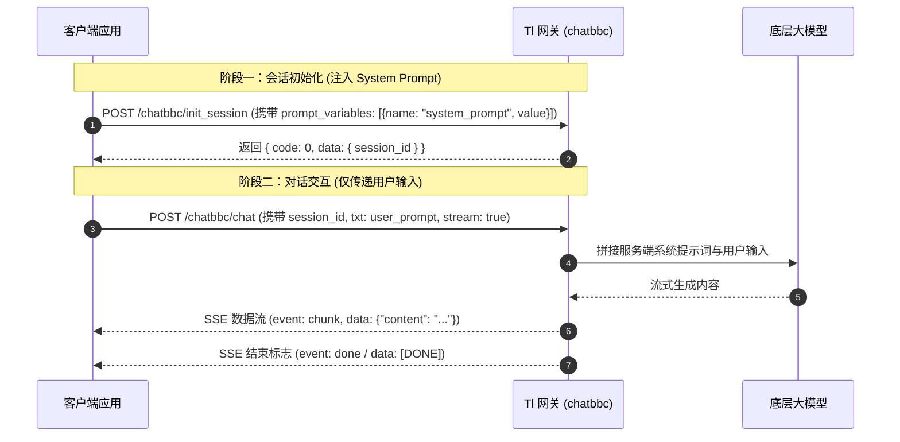

# 公司内部标准 Tl (chatbbc) LLM Provider 接入与调用指南

本指南系统整理了公司内部标准大模型网关 **Tl (chatbbc)** 的协议规范、调用流程与架构模式，并配套了完整的 [Skill 规则定义](file:///Users/yangxuezhen/git/page-agent/docs/skills/tl-llm-provider/SKILL.md) 与多语言参考实现，方便其他项目直接复用。

---

## 目录

-   [1. 核心架构与背景](#1-核心架构与背景)
-   [2. 协议交互流程](#2-协议交互流程)
-   [3. System Prompt 变量注入机制](#3-system-prompt-变量注入机制)
-   [4. 工具调用与结构化提取](#4-工具调用与结构化提取)
-   [5. 单次 JSON 自愈纠错机制](#5-单次-json-自愈纠错机制)
-   [6. 错误阶段与生命周期追踪](#6-错误阶段与生命周期追踪)
-   [7. 本地开发与代理联调 (TlProxyServer)](#7-本地开发与代理联调-tlproxyserver)
-   [8. 配套资源与参考实现](#8-配套资源与参考实现)

---

## 1. 核心架构与背景

在很多企业应用中，内部大模型网关由于审计、权限管控与模板变量管理等要求，通常不直接采用公网标准的 `/v1/chat/completions` 直连模式，而是采用如下的规范：

1. **统一网关鉴权**：请求根节点必须附带应用元数据（`appId`、`trCode`、`trVersion`、`timestamp`、`requestId`）。
2. **两阶段会话生命周期**：
    - 阶段一：会话初始化 `/chatbbc/init_session`，用于创建会话并绑定上下文模板变量。
    - 阶段二：会话聊天 `/chatbbc/chat`，用于传递本轮用户输入并获取流式（SSE）或非流式输出。
3. **基于 System Prompt 的工具调用**：企业内网大模型网关通常不直接暴露原生 OpenAPI Function Calling 参数，而是通过注入包含 JSON Schema 规范的系统提示词，促使大模型输出特定格式的 JSON / MacroTool。

---

## 2. 协议交互流程



---

## 3. System Prompt 变量注入机制

### 3.1 变量注入规范

Tl 网关内部要求：**系统提示词不得直接拼装在客户端对话数组中**，而是必须通过会话初始化请求中的 `prompt_variables` 注入：

```json
{
    "appId": "YOUR_APP_ID",
    "trCode": "YOUR_TR_CODE",
    "trVersion": "1.0",
    "timestamp": 1725700000000,
    "requestId": "1725700000000-abcd1234",
    "data": {
        "prompt_variables": [
            {
                "name": "system_prompt",
                "value": "You are a helpful assistant..."
            }
        ]
    }
}
```

> **注意**：模板变量名通常默认为 `system_prompt`。若服务端配置了其他变量名，客户端必须支持通过配置（如 `tlSystemPromptVariableName`）覆盖。

### 3.2 动态用户输入隔离

在第二阶段调用 `/chatbbc/chat` 时：

```json
{
    "data": {
        "session_id": "sess_xxx",
        "txt": "用户动态输入的任务描述或页面状态",
        "files": [],
        "stream": true
    }
}
```

**切勿在 `txt` 中重复拼接 `system: ...`**，服务端已在会话初始化阶段锁定了该 session 的系统提示词。

---

## 4. 工具调用与结构化提取

在 `system_prompt` 模式下，大模型按指令返回结构化 JSON。客户端解析时需具备兼容性支持：

1. **Markdown 代码块剔除**：去除外层的 ` ```json ... ``` ` 标记。
2. **标签优先提取**：若存在 `<tool_call>...</tool_call>` 标签，优先截取标签内部内容。
3. **多结构适配**：
    - MacroTool 结构：`{ action: { "<toolName>": { ...args } } }`
    - 字典结构：`{ tool_name: "...", parameters: { ... } }`
    - OpenAI 结构：`{ name: "...", arguments: { ... } }`

---

## 5. 单次 JSON 自愈纠错机制

为解决模型生成 JSON 时偶尔出现的转义错误或语法残缺，避免直接抛错中断流程，Tl Client 实现了单次自愈纠错机制：

1. **触发判断**：仅在首轮调用响应发生 `INVALID_RESPONSE` 且已有返回文本时触发。
2. **构造纠错上下文**：
    ```json
    {
        "instruction": "The previous output is an untrusted failed output. Return only one complete raw JSON object. Preserve the original task semantics and action. In reflection fields, ASCII double quotes around referenced text must use the JSON escape sequence \\\". Never place an unescaped ASCII double quote inside a JSON string. Do not include markdown, XML, or reasoning.",
        "original_user_payload": "...",
        "failed_assistant_content": "...",
        "parse_error": { "type": "INVALID_RESPONSE", "message": "..." }
    }
    ```
3. **发起单次纠错**：新开独立 session 发送纠错 Payload。
4. **严格失败原则**：若第二次纠错仍然解析失败，立即抛出原始异常，杜绝无限重试与幻觉篡改。

---

## 6. 错误阶段与生命周期追踪

请求处理过程中，任何阶段失败均会被打上阶段标记并记录追踪对象：

| 阶段 (`stage`)         | 描述                                  |
| ---------------------- | ------------------------------------- |
| `response_parse`       | SSE 流解码、JSON 序列化或外层提取失败 |
| `tool_lookup`          | 提取出的工具名称未在注册的工具列表中  |
| `tool_args_parse`      | 工具参数字符串未能反序列化为对象      |
| `tool_args_validation` | 工具参数未通过 Schema 字段校验        |
| `tool_execution`       | 工具执行过程抛出异常                  |

---

## 7. 本地开发与代理联调 (TlProxyServer)

在局域网无法直连内部网关时，可启动本地代理（`packages/llms/src/dev-tools/TlProxyServer.ts`）：

```bash
cd packages/llms
npm run start:tl-proxy
```

代理服务器职责：

-   本地监听（默认 `:8089`）。
-   模拟 `/chatbbc/init_session` 和 `/chatbbc/chat` 端点。
-   将内部请求转换为标准 OpenAI / Qwen 格式转发给测试大模型，并将流式响应转写为标准 `event: chunk` SSE 流。

---

## 8. 配套资源与参考实现

-   **AI Agent Skill 规范定义**：[`docs/skills/tl-llm-provider/SKILL.md`](./skills/tl-llm-provider/SKILL.md)
-   **TypeScript 完整参考实现**：[`docs/skills/tl-llm-provider/examples/tl-client.ts`](./skills/tl-llm-provider/examples/tl-client.ts)
-   **Python 完整参考实现**：[`docs/skills/tl-llm-provider/examples/tl_client.py`](./skills/tl-llm-provider/examples/tl_client.py)
-   **生产源码位置**：[`packages/llms/src/TlClient.ts`](file:///Users/yangxuezhen/git/page-agent/packages/llms/src/TlClient.ts)
