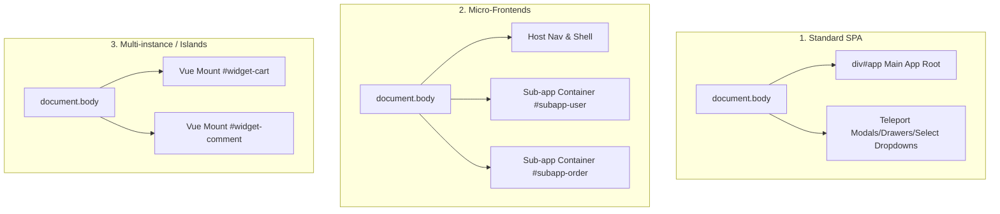

# Vue Project DOM Root Configuration Guide (P-Side / PageController)

> 中文版：[Vue 项目 DOM Root 配置指南](./vue-dom-root-guide.zh-CN.md)

This guide is intended for developers configuring `root` (trusted DOM root boundary) and architectural boundaries when integrating PageAgent / PageController into a **Vue project** on the **P-side (Parent Host Page)**.

---

## 1. Background & Core Concepts

In the PageAgent architecture, the P-side (host application page) uses `PageController` or `ParentPageControllerHost` to observe and interact with the page's DOM tree. To ensure operation security and accuracy, configuring a trusted `root` DOM boundary is required or recommended.

### 1.1 DomRoot Definition

In `@page-agent/page-controller`, the `DomRoot` type is defined as:

```typescript
export type DomRoot = Element | (() => Element | null | undefined)
```

-   **Static Element**: Passing a direct DOM `Element` (e.g. `document.getElementById('app')`).
-   **Functional Resolver (Recommended)**: Passing a function returning an `Element` (e.g. `() => document.querySelector('#app')`). The resolver is re-evaluated on every tree extraction and indexed action.

### 1.2 Fail-Closed Principle

The configured `root` undergoes strict validation (`resolveRoot`):

-   The node must belong to the current `document` and be connected (`isConnected === true`).
-   If the node is missing, disconnected, or cross-document, the system throws a `DomRootUnavailableError` immediately, **without falling back to `document.body`**.

---

## 2. How Many Roots Exist in a Vue Project?

In Vue (Vue 2 / Vue 3) ecosystems, the number of roots depends on the frontend architecture:



| Architecture                       | Active Roots                                   | Typical DOM Distribution                                                                                                       |
| :--------------------------------- | :--------------------------------------------- | :----------------------------------------------------------------------------------------------------------------------------- |
| **Standard SPA**                   | **1 Main App Root + N Detached Overlay Nodes** | `<div id="app"></div>` (Main App)<br>+ `<Teleport to="body">` dialogs, drawers, and select menus attached directly to `<body>` |
| **Micro-Frontends**                | **N Sub-app Roots (+ 1 Host Root)**            | Host shell container + independent sub-app mount points (e.g. `#subapp-viewport`, `<micro-app>` containers)                    |
| **Multi-instance / Islands (MPA)** | **N Independent Vue Mounts**                   | Traditional server-rendered or multi-page apps with multiple `createApp().mount('#widget-xxx')` instances                      |
| **Web Components / Shadow DOM**    | **1 ShadowRoot per Custom Element**            | Custom elements created via Vue 3 `defineCustomElement` containing isolated `#shadow-root` trees                               |

---

## 3. When and How to Differentiate Roots

When configuring `root` for the P-side, the core trade-off lies between **Scope Isolation** and **Global Element Accessibility (e.g., Modals and Dropdowns)**:

### Scenario 1: Scoped to Sub-app or Business Container (Strict Isolation)

-   **Use Case**:
    -   In micro-frontend architectures, the P-side acts as a host and needs to constrain the Agent to a single sub-app, preventing accidental clicks on the host's navigation bar, logout button, or neighboring apps.
    -   The page contains third-party ads, untrusted scripts, or external shell UI.
-   **Configuration**: Set `root` to the business container element (e.g. `root: () => document.querySelector('#subapp-container')`).
-   **Caveat**: If the sub-app's modals teleport into the host `body`, scoping `root` to the sub-app container will hide modals from the Agent.

### Scenario 2: Whole-Page Flow Automation (Including Teleported Modals & Popovers)

-   **Use Case**:
    -   Standard Vue 3 business applications utilizing UI libraries (Element Plus, Ant Design Vue, Naive UI, Arco Design, etc.).
    -   Workflows requiring: filling a form → clicking submit → confirming in a Modal dialog → completion.
-   **Reason**: Vue 3's `<Teleport to="body">` mounts modals directly into `document.body` (**outside `#app`**). Setting `root` to `#app` will cause the Agent to fail to locate modals.
-   **Configuration**:
    -   In standalone `PageController`: `root: undefined` (defaults to `document.body`), combined with `contentBlacklist` to exclude unwanted elements.
    -   In `ParentPageControllerHost` (which requires `root`): configure `root: () => document.body` or a common parent wrapping both `#app` and the modal container.

### Scenario 3: SPA Route Transitions / Dynamic Remounting

-   **Use Case**:
    -   During Vue Router navigation, layout containers or sub-app mount points are destroyed and recreated.
-   **Configuration**: **Always use a functional resolver (`() => Element`)** to ensure every tree extraction retrieves the latest live DOM node, avoiding `DomRootUnavailableError`.

---

## 4. Configuration Examples

### Example 1: ParentPageControllerHost (P-Side) with a Standard Vue 3 App

When integrating a cross-origin assistant iframe into the parent page (P-side), use a functional `root` alongside `contentBlacklist`:

```typescript
import { createParentControllerHost } from '@page-agent/page-controller'

const assistantIframe = document.querySelector<HTMLIFrameElement>('#assistant-iframe')!

const host = createParentControllerHost({
    iframe: assistantIframe,
    assistantOrigin: 'https://assistant.example.com',
    scopeId: 'shop-admin-v1',
    capabilities: ['click', 'input', 'scroll', 'read_state'],

    // 1. Explicit trusted DOM root (recommend document.body or a shared container including Teleport overlays)
    root: () => document.body,

    // 2. Controller options: exclude assistant iframe and sensitive elements via contentBlacklist
    controllerOptions: {
        contentBlacklist: [
            // Exclude assistant iframe to prevent the Agent from looping on its own UI
            assistantIframe,
            // Exclude watermark overlays
            () => document.querySelector('.global-watermark'),
            // Exclude sensitive user credentials
            () => document.querySelector('.sensitive-auth-card'),
        ],
    },

    getEmbedPolicy: async (ctx) => {
        const res = await fetch('/api/page-agent/embed-policy', {
            method: 'POST',
            headers: { 'Content-Type': 'application/json' },
            body: JSON.stringify(ctx),
        })
        const { policy } = await res.json()
        return policy
    },

    verifyEmbedPolicy: async (policy, ctx) => {
        const res = await fetch('/api/page-agent/verify-policy', {
            method: 'POST',
            headers: { 'Content-Type': 'application/json' },
            body: JSON.stringify({ policy, ...ctx }),
        })
        return res.json()
    },
})

await host.start()
```

---

### Example 2: Micro-Frontend Sub-App Isolation

To strictly confine the Agent to the active micro-frontend sub-app:

```typescript
import { PageController } from '@page-agent/page-controller'

const controller = new PageController({
    // Use a functional resolver to dynamically find the active sub-app container
    root: () => {
        const activeSubApp = document.querySelector(
            '#subapp-viewport > [data-active="true"], .micro-app-active-container'
        )
        return activeSubApp || document.querySelector('#subapp-viewport')
    },
})
```

---

### Example 3: Custom Teleport Mount Container in Vue 3

In well-structured Vue 3 applications, Teleport targets can be customized to achieve both isolation and modal visibility:

```html
<!-- Vue app index.html / App.vue -->
<div id="portal-root-boundary">
    <!-- 1. Main App mount point -->
    <div id="app"></div>

    <!-- 2. Shared modal container -->
    <div id="modal-container"></div>
</div>
```

```vue
<!-- Vue Component -->
<template>
    <button @click="visible = true">Open Details</button>
    <Teleport to="#modal-container">
        <div v-if="visible" class="custom-modal">...</div>
    </Teleport>
</template>
```

```typescript
// P-side PageController configuration: root set to #portal-root-boundary
const controller = new PageController({
    root: () => document.querySelector('#portal-root-boundary'),
})
```

---

## 5. Troubleshooting & FAQs

### Q1: Why does the Agent report "Cannot find confirmation button" after clicking a trigger?

-   **Cause**: The P-side configured `root: document.getElementById('app')`. UI library dialogs (Element Plus, Ant Design Vue, etc.) teleport into `document.body` outside `#app`, rendering them invisible to the Agent.
-   **Solution**:
    1. Expand `root` to `document.body` (or a shared outer parent).
    2. Use `contentBlacklist` to filter out unwanted sections.

### Q2: Why does the application throw `DomRootUnavailableError` after page navigation?

-   **Cause**: A **static DOM element** was passed during initialization (e.g. `root: document.querySelector('.page-container')`). Route transitions or re-renders destroyed the original node, causing `node.isConnected` to become `false`.
-   **Solution**: Always provide a **functional resolver**:

    ```typescript
    // Avoid: static reference breaks after re-render
    root: document.querySelector('.page-container'),

    // Recommended: re-evaluated dynamically
    root: () => document.querySelector('.page-container'),
    ```

### Q3: Does the `root` element receive an interactive index?

-   **No**. The `root` element is treated as a synthetic container boundary. Only interactive descendant elements within `root` are assigned interactive indices for LLM consumption.
