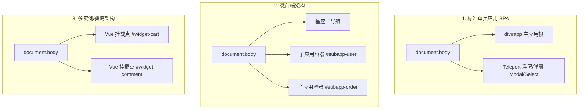

# Vue 项目 DOM Root 配置指南（P 端 / PageController）

本文面向在 **P 端（Parent 宿主页面）** 接入 PageAgent / PageController 时，针对 **Vue 项目** 进行 `root`（DOM 根节点边界）配置与架构设计的开发者。

---

## 1. 背景与核心概念

在 PageAgent 体系中，P 端（宿主业务页面）通过 `PageController` 或 `ParentPageControllerHost` 观察和操作页面的 DOM 树。为了保障操作的安全性和精确性，系统要求或支持配置 `root`（受信任 DOM 根边界）。

### 1.1 DomRoot 定义

在 `@page-agent/page-controller` 中，`DomRoot` 类型定义如下：

```typescript
export type DomRoot = Element | (() => Element | null | undefined)
```

-   **静态节点**：直接传入 DOM `Element`（如 `document.getElementById('app')`）。
-   **函数式 Resolver（推荐）**：传入一个返回 `Element` 的函数（如 `() => document.querySelector('#app')`）。在每次 DOM 树抽取或执行交互动作时，系统都会重新调用该函数求值。

### 1.2 Fail-Closed（安全失败）原则

配置的 `root` 会经过严格的有效性校验（`resolveRoot`）：

-   节点必须处于当前 `document` 且处于已连接状态（`isConnected` 为 true）。
-   若节点不存在、断开连接或跨 document，系统会直接抛出 `DomRootUnavailableError`，**不会悄默回退到 `document.body`**。

---

## 2. Vue 项目中一般会有多少个 Root？

在 Vue（Vue 2 / Vue 3）生态中，Root 数量取决于前端架构设计：



| 架构形态                              | 活跃 Root 数量                             | 典型的 DOM 分布                                                                                               |
| :------------------------------------ | :----------------------------------------- | :------------------------------------------------------------------------------------------------------------ |
| **标准单页应用 (SPA)**                | **1 个主应用 Root + N 个脱离流的浮层节点** | `<div id="app"></div>`（挂载主组件）<br>+ `<Teleport to="body">` 挂载在 `<body>` 直属下的弹窗、抽屉、下拉列表 |
| **微前端应用 (Micro-Frontend)**       | **N 个子应用 Root (+ 1 个基座 Root)**      | 基座应用自身根节点 + 各子应用独立挂载容器（如 `#subapp-viewport`、`<micro-app>` 容器等）                      |
| **多实例 / 孤岛架构 (MPA / Islands)** | **N 个独立 Vue 挂载点**                    | 传统服务端渲染或多页页面中，不同区块分别执行 `createApp().mount('#widget-xxx')`                               |
| **Web Components / Shadow DOM**       | **每个自定义组件 1 个 ShadowRoot**         | Vue 3 `defineCustomElement` 包装的独立 WebComponent，内部拥有独立的 `#shadow-root`                            |

---

## 3. 分别在什么情况下做区分？

在为 P 端配置 `root` 时，核心决策在于**操作范围的安全性（Scope Isolation）**与**全局组件可达性（如弹窗/下拉框）**之间的平衡：

### 场景 1：限定在子应用或局部业务容器（强隔离）

-   **适用情况**：
    -   微前端架构中，P 端作为基座，只允许 Agent 自动化某一个子应用，避免误点击基座的全局菜单、退出按钮或其他子应用。
    -   页面上存在第三方广告、不可信脚本或复杂的外部外壳，需要做安全边界限定。
-   **配置方式**：将 `root` 指定为该业务容器的根元素（例如 `root: () => document.querySelector('#subapp-container')`）。
-   **注意事项**：若该子应用内部弹窗挂载到了基座的 `body` 上，限定在子应用容器将导致 Agent 无法操作弹窗（见下文解决方案）。

### 场景 2：整页业务流程自动化（包含 Teleport 弹窗与下拉框）

-   **适用情况**：
    -   绝大部分标准的 Vue 3 业务系统（使用了 Element Plus, Ant Design Vue, Naive UI, Arco Design 等组件库）。
    -   业务流包含：表单填写 → 点击提交 → 弹出二次确认弹窗（Modal） → 确认成功。
-   **原因**：Vue 3 的 `<Teleport to="body">` 会将弹窗 DOM 节点直接插入到 `document.body`，**位于 `#app` 之外**。如果将 `root` 设为 `#app`，Agent 将无法感知弹窗。
-   **配置方式**：
    -   在独立 `PageController` 中：`root: undefined`（默认使用 `document.body`），配合 `contentBlacklist` 过滤不需要的元素。
    -   在 `ParentPageControllerHost`（强校验 `root`）中：配置 `root: () => document.body` 或包裹了应用与弹窗的最外层公共容器。

### 场景 3：单页路由切换 / 动态重挂载

-   **适用情况**：
    -   Vue Router 切换页面时，某些布局容器或子应用根节点被销毁并重新创建。
-   **配置方式**：**必须使用函数式 Resolver（`() => Element`）**，确保每次重新抽取 DOM 树时都能获取当前最新的 DOM 实例，避免 `DomRootUnavailableError`。

---

## 4. 详细配置示例

### 示例 1：ParentPageControllerHost (P 端) 接入标准 Vue 3 应用

在父页面（P 端）接入跨域助手 iframe 时，推荐使用函数式 `root`，并配合 `contentBlacklist` 屏蔽助手自身 UI 或敏感区域：

```typescript
import { createParentControllerHost } from '@page-agent/page-controller'

const assistantIframe = document.querySelector<HTMLIFrameElement>('#assistant-iframe')!

const host = createParentControllerHost({
    iframe: assistantIframe,
    assistantOrigin: 'https://assistant.example.com',
    scopeId: 'shop-admin-v1',
    capabilities: ['click', 'input', 'scroll', 'read_state'],

    // 1. 明确受信任的 DOM 根节点（推荐使用包含 Teleport 的公共容器或 document.body）
    root: () => document.body,

    // 2. 传递底层控制器配置：使用 contentBlacklist 排除不相关或敏感的 DOM 区域
    controllerOptions: {
        contentBlacklist: [
            // 排除助手 iframe 自身，防止 Agent 循环操作自己
            assistantIframe,
            // 排除页面全局水印层
            () => document.querySelector('.global-watermark'),
            // 排除敏感的用户个人信息脱敏卡片
            () => document.querySelector('.sensitive-auth-card'),
        ],
    },

    getEmbedPolicy: async (ctx) => {
        // 从 P 端 BFF 获取一次性 Policy 凭证
        const res = await fetch('/api/page-agent/embed-policy', {
            method: 'POST',
            headers: { 'Content-Type': 'application/json' },
            body: JSON.stringify(ctx),
        })
        const { policy } = await res.json()
        return policy
    },

    verifyEmbedPolicy: async (policy, ctx) => {
        // 校验 Policy 合法性
        const res = await fetch('/api/page-agent/verify-policy', {
            method: 'POST',
            headers: { 'Content-Type': 'application/json' },
            body: JSON.stringify({ policy, ...ctx }),
        })
        return res.json()
    },
})

await host.start()
```

---

### 示例 2：微前端（qiankun / micro-app）子应用专属隔离

如果需要将 Agent 严格限制在当前激活的子应用区域内：

```typescript
import { PageController } from '@page-agent/page-controller'

const controller = new PageController({
    // 使用函数式 resolver 动态定位当前活跃的微前端子应用
    root: () => {
        // 优先匹配当前展示的业务子应用容器
        const activeSubApp = document.querySelector(
            '#subapp-viewport > [data-active="true"], .micro-app-active-container'
        )
        return activeSubApp || document.querySelector('#subapp-viewport')
    },
})
```

---

### 示例 3：处理 Vue 3 Teleport 挂载点自定义

在一些架构良好的 Vue 3 项目中，为了兼顾“作用域隔离”与“弹窗可感知”，可以在业务代码中把 Teleport 挂载到指定子容器内，而非全局 `body`：

```html
<!-- Vue 项目 index.html / App.vue -->
<div id="portal-root-boundary">
    <!-- 1. 主应用挂载区 -->
    <div id="app"></div>

    <!-- 2. 统一的业务弹窗挂载容器 -->
    <div id="modal-container"></div>
</div>
```

```vue
<!-- Vue 组件中使用 Teleport 指定到该容器 -->
<template>
    <button @click="visible = true">打开详情</button>
    <Teleport to="#modal-container">
        <div v-if="visible" class="custom-modal">...</div>
    </Teleport>
</template>
```

```typescript
// P 端 PageController 配置：将 root 设为 #portal-root-boundary
const controller = new PageController({
    root: () => document.querySelector('#portal-root-boundary'),
})
```

---

## 5. 常见问题与避坑指南

### Q1: 为什么点击了按钮后弹出弹窗，Agent 提示“找不到对应的确认按钮”？

-   **原因**：P 端将 `root` 设置为了 `document.getElementById('app')`。而 Element Plus / Ant Design Vue / Naive UI 等组件库的 `Dialog` / `Modal` 默认使用 Teleport 插入到了 `document.body` 的最下方，**不在 `#app` 节点内部**，导致 DOM 抽取时弹窗被过滤。
-   **解决办法**：
    1. 将 `root` 扩大至 `document.body`（或包含弹窗的公共外层父容器）。
    2. 使用 `contentBlacklist` 精确屏蔽不需要操作的区域。

### Q2: 为什么路由切换或者页面重新加载后抛出 `DomRootUnavailableError`？

-   **原因**：初始化配置时使用了**静态 DOM 引用**（如 `root: document.querySelector('.page-container')`）。当 Vue 页面发生路由切换或重新渲染时，旧 DOM 节点被销毁，导致 `node.isConnected` 变为 `false`。
-   **解决办法**：始终使用**函数式 Resolver**：

    ```typescript
    // 错误写法（静态引用，DOM 重建后失效）
    root: document.querySelector('.page-container'),

    // 正确写法（函数形式，每次动态计算）
    root: () => document.querySelector('.page-container'),
    ```

### Q3: `root` 节点自身会被赋予交互序号（Index）吗？

-   **不会**。`root` 节点本身被视为合成的非交互容器边界，只有 `root` 内部的子孙可交互元素才会被分配 Index 并暴露给大模型。
